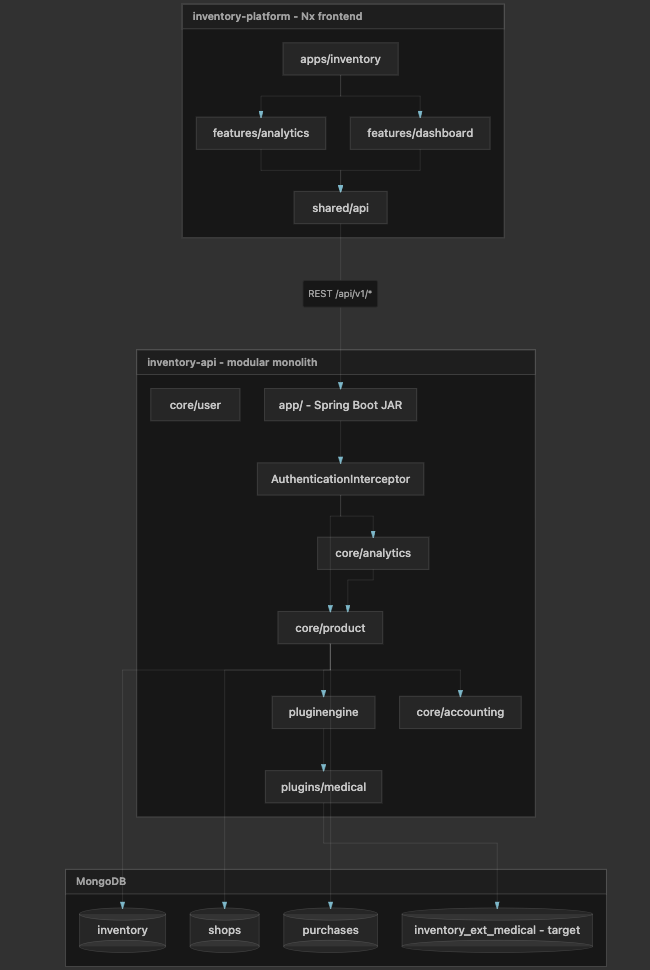

# StockKart Vertical Plugin Architecture v4

**Implementation guide for multi-vertical inventory (medical, apparel, cafe/F&B, sports, …)**

StockKart supports many industries through **one platform**: minimal core `Inventory`, **per-vertical extension collections** (`inventory_ext_medical`, …), and thin **plugins** coordinated by **`InventoryService`** in the product module. No separate orchestrator layer. No client-sent `verticalId` — the server resolves it from `Shop.verticalId`.

---

## Table of contents

**Core (read first)**

1. [Overview](#1-overview)
2. [System architecture](#2-system-architecture)
3. [Request flow and InventoryService](#3-request-flow-and-inventoryservice)
4. [Data model](#4-data-model)
5. [Plugin system](#5-plugin-system)
6. [Schema and UI](#6-schema-and-ui)
7. [Codebase layout](#7-codebase-layout)
8. [Shop isolation](#8-shop-isolation)
9. [Migration](#9-migration)
10. [Implementation roadmap](#10-implementation-roadmap)
11. [Adding a new vertical](#11-adding-a-new-vertical)
12. [Example: Cafe / F&B](#12-example-cafe--fb)

**Reference (detail when implementing)**

- [Search](#reference-search)
- [Analytics](#reference-analytics)
- [Operations and checklists](#reference-operations)
- [Edge cases and anti-patterns](#reference-edge-cases)
- [Example schemas (JSON)](#reference-example-schemas)
- [Document maintenance](#document-maintenance)

---

## 1. Overview

Build **one inventory platform** capable of supporting many industries without:

- Separate applications or duplicate codebases
- A giant `Inventory` table with dozens of nullable vertical columns
- JSON-only storage that cannot be searched at scale
- Core code full of `if (vertical == medical)` branches

A new vertical (e.g. jewelry with `carat`, `purity`, `certificateNo`) must be addable with **minimal impact on existing shops** and **no changes to** Order, Customer, Checkout, or Accounting.

### Goals

- Support **10–20+ verticals** long-term
- Each shop has different fields, validations, UI, search, and reports
- Keep **cart, checkout, accounting, users, pricing** universal
- **Fast indexed search** on vertical-specific fields (expiry, size, sport, …)
- Add verticals **additively** — existing shops unchanged

### Core principles

| # | Principle | Meaning |
|---|-----------|---------|
| 1 | **Thin core** | Core owns universal concepts only. It must never know `expiryDate`, `size`, `sport`, `carat`, etc. |
| 2 | **Vertical ownership** | Each vertical owns schema, validation, search, import, widgets, reports, and **its extension storage** |
| 3 | **Schema-driven UI** | Frontend never hardcodes vertical forms; UI is generated from API schema |
| 4 | **Indexed search fields** | Fields used for search/filter/sort/reports live in **indexed extension storage**, not unindexed JSON |
| 5 | **Additive growth** | New vertical = new plugin + new extension collection. Core unchanged |
| 6 | **Stable API** | Clients call the same endpoints; merged responses hide storage layout |
| 7 | **Shop-scoped queries** | Every query starts with `shopId` |
| 8 | **Vertical is stable** | Chosen at shop creation; switching is a rare admin migration |

### Today vs target

#### Today (baseline)

| Area | Current |
|------|---------|
| Backend | `pluginengine` with stub `ProductPlugin`; `plugins/medical` is empty |
| Inventory | Large `Inventory` document with pharmacy fields (`batchNo`, `expiryDate`, …) baked into core |
| Business type | Hardcoded pharmacy assumptions; no `Shop.verticalId` yet |
| Frontend | Hardcoded forms; `businessType: 'pharmacy'` on many requests |
| Shop | `ShopType` (RETAILER / WHOLESALER); no `verticalId` |

#### Target (v4)

| Area | Target |
|------|--------|
| Shop | `verticalId` + `pluginVersion` |
| Inventory (core) | Universal fields only — no vertical columns |
| Vertical data | One extension collection per vertical (e.g. `inventory_ext_medical`) |
| Plugin engine | Registry, schema loader, extension router |
| Product service | **`InventoryService`** — plugin resolution, core + extension coordination |
| Plugins | Schema, validators, `SearchProvider`, import mappers, widgets |
| Frontend | Dynamic form renderer + lazy-loaded vertical UI packs |
| API | Stable CRUD/search; `GET /shops/me/schema` drives UI |

---

## 2. System architecture




*Nx frontend → REST `/api/v1/*` → Spring Boot → core modules → **`InventoryService`** (product hub) → pluginengine / plugins → MongoDB.*

### Layer responsibilities

| Layer | Owns | Must NOT own |
|-------|------|--------------|
| **Controllers** | HTTP, auth context (`userId`, `shopId`), DTO mapping | Plugin resolution, Mongo access |
| **Module services** | Domain logic for that module (profit, checkout, reminders) | Direct cross-module repository calls |
| **Product / `InventoryService`** | Core inventory CRUD, plugin resolution, txn core+extension, merged inventory views | Vertical-specific business rules (delegates to plugin) |
| **Plugin engine** | Discover plugins, schema loading | Vertical field definitions |
| **Vertical plugin** | Schema, extension repo, validators, search, import | Duplicate checkout/cart controllers |
| **Frontend pack** | Custom widgets (expiry badge, size matrix) | API business logic |

---

## 3. Request flow and InventoryService


**Rule:** Controller → module Service → (often) **`InventoryService`** → plugin → repository. Cross-module: **Service → Service** — never call another module's repository.


**Final design (v4):** No separate orchestrator or facade classes. The **product module** is the centre of the application. **`InventoryService`** in `core/product` resolves the vertical plugin from `Shop.verticalId` and coordinates core inventory with extension storage.

### Standard request flow

```
Frontend
  → API Controller (any module)
  → Module Service (analytics, checkout, reminders, …)
  → InventoryService (product)     ← most inventory / vertical flows pass through here
  → PluginRegistry → VerticalPlugin
  → Product InventoryRepository  and/or  plugin ExtensionRepository
  → merged response
```

| Example | Call chain |
|---------|------------|
| Register product | `InventoryController` → `InventoryService.create()` |
| Profit analytics needing inventory context | `ProfitAnalyticsController` → `ProfitAnalyticsService` → **`InventoryService`** (batch load / dimensions) |
| Checkout display vertical fields | `CheckoutController` → `CheckoutService` → **`InventoryService.getMergedView()`** |
| Near-expiry search | `InventoryController` → `InventoryService.search()` → plugin `SearchProvider` |

Controllers stay thin. **Plugin resolution never lives in the controller** and **never trusts a vertical id from the frontend** — only authenticated `shopId` → `Shop.verticalId`.

### Why `InventoryService` instead of a separate orchestrator

| Concern | Handled by |
|---------|------------|
| Product is the main domain of StockKart | Existing `InventoryService` already owns inventory CRUD |
| Resolve plugin from shop | `InventoryService` loads `Shop`, calls `PluginRegistry.get(verticalId)` |
| Split core vs extension payload | Schema-driven split inside `InventoryService` (or private helpers in same module) |
| Transaction core + extension | `InventoryService` `@Transactional` boundary |
| Merged API DTO | `InventoryService` + `VerticalInventoryMapper` |
| Avoid extra abstraction layer | One well-known entry point for all modules |

No `InventoryWriteOrchestrator`, `ReadFacade`, or `SearchFacade` — same responsibilities, **inside product service**.

### `InventoryService.create()` (register / write)

```
1. Auth → shopId (from controller; set by interceptor)
2. ShopRepository → verticalId, pluginVersion
3. PluginRegistry → VerticalPlugin
4. Split payload: core vs extension (schema storage flags)
5. Validate core fields (existing InventoryValidator)
6. plugin.getInventoryValidator().validate(extensionPayload, shopId)
7. Mongo transaction start
8. InventoryRepository.save(core)
9. plugin.getExtensionRepository().save(inventoryId, shopId, extensionPayload)
10. Commit transaction
11. Post-write hooks (ReminderService, events) — call other module **services**, not their repos
12. Return merged InventoryView / InventoryReceiptResponse
```

### `InventoryService.getById()` / list hydrate (read)

```
1. InventoryRepository.findByIdAndShopId(id, shopId)
2. PluginRegistry → plugin → extensionRepository.findByInventoryId(shopId, id)
3. Merge (schema-driven); migration fallback → extensionStatus PARTIAL if needed
4. Return flat DTO
```

**List views:** batch `findByInventoryIdIn(shopId, ids)` — no N+1.

### `InventoryService.search()` (vertical filters)

```
1. shopId → Shop → plugin
2. plugin.getSearchProvider().search(shopId, filters, pagination) → inventoryIds
3. Batch load core + extension
4. Merge page; return cursor pagination
```

Clients call `GET /inventory/search?…` — they never know which extension collection ran the query.

---


### Cross-module access

Modules must not reach into each other's repositories directly. Default rule: **Service → Service → Repository**.

When that would create a **Maven circular dependency** (A depends on B and B depends on A), use the **adapter / facade pattern already in the codebase** — same idea as SPI: **interface in the consumer module, implementation in the owner module**.

```
┌─────────────────┐         ┌─────────────────┐         ┌──────────────────┐
│ analytics       │         │ product         │         │ accounting       │
│ ProfitAnalytics │ ──────► │ InventoryService│         │ AccountingService│
│ Service         │  calls  │                 │ ◄────── │                  │
└─────────────────┘  service└────────┬────────┘  facade └────────┬─────────┘
                                     │                              │
                                     ▼                              ▼
                            InventoryRepository              AccountRepository
                            (+ plugin ExtensionRepo)         (accounting module only)
```

| Rule | Meaning |
|------|---------|
| **Controller → own module Service** | Never skip service layer |
| **Module A → Module B (no cycle)** | Call **B's Service** directly |
| **Module A ↔ Module B (cycle risk)** | **Adapter interface** in one module, **`*Impl`** in the other — see below |
| **Service → own Repository** | Repos stay inside owning module |
| **Product + plugin extension** | `InventoryService` invokes plugin `ExtensionRepository` via `VerticalPlugin` — product never imports `MedicalInventoryExtension` |
| **No vertical header from frontend** | `verticalId` from `Shop` row only |

#### Breaking circular dependencies (adapter / facade)

**Problem:** `product` needs `reminders` and `reminders` needs inventory data → cannot have both modules depend on each other's services.

**Solution:** Consumer module defines a **narrow interface**. Owner module provides **`@Component` implementation** that delegates to its service (or repo for read-only summaries).

```
┌──────────────────┐                      ┌─────────────────────────────┐
│  consumer module │                      │  owner module (product)      │
│                  │   depends on         │                              │
│  InventoryAdapter│ ◄── interface only   │  InventoryAdapterImpl        │
│  (interface)     │                      │    → InventoryRepository   │
│                  │                      │    (or InventoryService)   │
│  ReminderService │                      │                              │
└──────────────────┘                      └─────────────────────────────┘

Maven:  reminders  ✗  product
        product   →  reminders   (for interface + DTOs only)
```

| Pattern | Interface (consumer / API module) | Implementation (owner) | Delegates to |
|---------|-----------------------------------|------------------------|--------------|
| Inventory for reminders | `reminders.service.InventoryAdapter` | `product.service.InventoryAdapterImpl` | `InventoryRepository` |
| Shop for user / auth | `user.service.ShopServiceAdapter` | `product.service.ShopServiceAdapterImpl` | `ShopService` |
| Shop for plan / usage | `plan.service.ShopProvider` | `product.config.ShopProviderImpl` | `ShopService` |
| Pricing for product | `pricing.service.InventoryPricingAdapter` | `pricing.service.InventoryPricingAdapterImpl` | `PricingService` |
| Ledger postings | `accounting.api.AccountingFacade` | `accounting.service.AccountingFacadeImpl` | accounting services |
| Credit bridge | `credit.service.CreditChargeFacade` | `product.service.AccountingCreditChargeFacade` | `AccountingFacade` |

**Rules for adapters**

| Do | Don't |
|----|-------|
| Keep interface **small** — only what the consumer needs | Expose full entity graphs or repositories |
| Implementation lives in the **owning** module (`product`, `accounting`, …) | Put `*Impl` in the consumer module |
| Prefer delegate to **Service** inside impl | Caller reaches foreign `Repository` directly |
| Use `@Autowired(required = false)` in consumer when optional (existing pattern in `InvitationService`) | Fail startup when adapter missing if module always present |
| Return **DTOs / summaries**, not Mongo entities across modules | Leak `Inventory` entity into reminders/analytics |

**Example (existing — reminders ← product):**

```java
// core/reminders — interface only, no product dependency
public interface InventoryAdapter {
  ReminderInventorySummary getInventorySummary(String inventoryId);
  boolean inventoryExists(String inventoryId);
}

// core/product — implementation
@Component
public class InventoryAdapterImpl implements InventoryAdapter {
  @Autowired private InventoryRepository inventoryRepository;
  // maps to ReminderInventorySummary
}
```

#### Target v4: analytics and plugins without cycles

| Scenario | Approach |
|----------|----------|
| Analytics needs inventory + vertical dimensions | **Preferred:** `analytics` → `product` dependency already exists → call **`InventoryService.getMergedView()` / `resolveDimensions()`** directly (no cycle) |
| Product must not depend on analytics | Never import analytics from product; use events if product needs to notify analytics later |
| Reminders need inventory after plugin migration | Extend **`InventoryAdapter`** (or add methods) in reminders; implement in **`InventoryAdapterImpl`** using **`InventoryService`** merge + plugin — reminders still does not depend on plugin types |
| Two modules both need each other | Extract shared **interface + DTOs** into consumer (or `common` if truly shared); **one** `@Component` impl in owner |

**Do not** add `product → analytics → product`. If both directions are ever required, introduce an **`InventoryReadAdapter`** interface in analytics (or `common.api`) and implement it in product — same pattern as `InventoryAdapter`.

### Examples

| Caller | Correct | Wrong |
|--------|---------|-------|
| `ProfitAnalyticsService` needs inventory / vertical dimensions | `InventoryService.resolveDimensions(shopId, ids)` — or `InventoryReadAdapter` if cycle | `InventoryRepository` from analytics |
| `ReminderService` needs batch/expiry label | `InventoryAdapter.getInventorySummary()` → impl uses merge/service | Reminders importing `inventory_ext_medical` |
| `CheckoutService` needs batch/expiry for display | `InventoryService.getMergedView(shopId, inventoryId)` | Query extension collection from checkout |
| `InventoryService` needs accounting entry on stock-in | `AccountingFacade.postVendorPurchaseInvoice(...)` | `AccountRepository` from product |
| `AuthService` needs shop tax info | `ShopServiceAdapter.getShopTaxInfo(shopId)` | `ShopRepository` from user module |
| `PlanService` needs shop plan fields | `ShopProvider.getShop(shopId)` | `ShopRepository` from plan module |

Analytics, checkout, cart, and reminders **delegate inventory + vertical work to `InventoryService` or an inventory adapter**, which alone resolves the plugin.

---


### End-to-end flows

### Create inventory

```
POST /inventory  { core fields + extension fields (flat or nested) }

→ InventoryController
→ InventoryService.create()
→ Shop → PluginRegistry → plugin
→ split by schema storage flags
→ validate core + plugin
→ save inventory + inventory_ext_<vertical>  (transaction)
→ return merged DTO
```

### Get inventory detail

```
GET /inventory/{id}

→ InventoryController
→ InventoryService.getById()
→ load core + extension
→ merge per schema
→ return DTO
```

### Search (near expiry)

```
GET /inventory/search?expiryBefore=2026-06-30&qtyMin=1

→ InventoryController
→ InventoryService.search()
→ MedicalSearchProvider queries inventory_ext_medical (indexed)
→ inventoryIds → batch hydrate
→ paginated merged response
```

### Analytics (profit / inventory)

```
GET /api/v1/analytics/profit?...

→ ProfitAnalyticsController
→ ProfitAnalyticsService
→ PurchaseRepository (analytics module — own repo OK)
→ InventoryService.resolveDimensions(shopId, inventoryIds)   ← product service, not InventoryRepository from analytics
→ aggregate → response
```

### Schema for UI

```
GET /shops/me/schema

→ shop.verticalId → plugin.getSchema()
→ return JSON
→ frontend renders forms
```

---


### Write / read / search ownership

This section defines who is responsible for writes, reads, and search so the system stays maintainable as verticals grow.

### Guiding rule

- **`InventoryService` (product) owns plugin resolution, transactions, and merged inventory views**
- **Other modules call `InventoryService`, not product or plugin repositories**
- **Plugins own vertical rules and search strategy**

Plugins should not expose their own CRUD controllers for standard inventory flows.

### Write responsibility

| Concern | Owner | Notes |
|---------|-------|-------|
| HTTP endpoint contracts (`POST /inventory`, `PATCH /inventory/{id}`) | Product controller | Stable API for all verticals |
| Auth + shop resolution (`shopId → verticalId`) | Product / `InventoryService` | Load `Shop`; never trust client vertical header |
| Transaction boundary | `InventoryService` | Save core + extension atomically |
| Core inventory persistence | `InventoryRepository` (product) | `inventory` collection only |
| Vertical field validation | Plugin | Via `InventoryValidator` + schema |
| Extension payload mapping | Plugin | Schema/storage-aware mapping |
| Extension persistence call | `InventoryService` invokes plugin repository | Product controls order + rollback |
| Post-write hooks (reminders, analytics) | Other module **services**, invoked by `InventoryService` | Must be idempotent |

### Read responsibility

| Concern | Owner | Notes |
|---------|-------|-------|
| Detail endpoint (`GET /inventory/{id}`) | Product controller → `InventoryService` | Stable contract |
| Core row read | `InventoryRepository` | From `inventory` |
| Extension row read | Plugin repository via `InventoryService` | No direct controller or cross-module repo access |
| DTO merge (core + extension) | `InventoryService` + mapper | Schema-driven output |
| List hydration | `InventoryService` | **Batch** extension reads (`findByInventoryIdIn`) to avoid N+1 |

### Search responsibility

Use a two-layer strategy:

1. **Default:** plugin `SearchProvider` executes indexed extension queries and returns `inventoryIds`
2. **`InventoryService.search()`:** batch-hydrates core + extension and returns merged page

| Concern | Owner | Notes |
|---------|-------|-------|
| Parse API filters/pagination | `InventoryService` | Validate common params |
| Vertical-specific query logic | Plugin `SearchProvider` | Uses extension indexes |
| Result pagination contract | `InventoryService` | Cursor/page normalization |
| Response hydration | `InventoryService` | Batch reads, merged DTO |

### Non-negotiable boundaries

- No plugin-owned inventory CRUD endpoints
- No module other than product should call `InventoryRepository` for vertical-enriched flows — use **`InventoryService`**
- No service should hardcode `inventory_ext_medical` (or any vertical collection)
- No plugin should independently manage transaction scope for standard inventory writes
- All list/search flows must use batch extension loads (no per-row extension lookup)

### Why this works

- Product remains the single hub for inventory + vertical behaviour
- Other modules stay decoupled from plugin storage details
- Lets each plugin optimize validation/search internally without leaking collection names to clients

---


---

## 4. Data model


### Shop

```
Shop
├── shopId, name, status, …
├── shopType              RETAILER | DISTRIBUTOR | WHOLESALER   (how they sell)
├── verticalId            medical | apparel | sports | …        (what they sell)
├── pluginVersion         1.0.0                                  (pinned behavior)
└── config                { enabledFeatures, overrides }         (optional)
```

`verticalId` determines which plugin is active for the shop.

### Inventory (core — universal only)

```
Inventory
├── id, shopId
├── barcode, name, description
├── quantities / units (received, sold, current, baseUnit, conversions)
├── pricingId, vendorId, location
├── hsn                    (if used cross-vertical for tax)
├── status                 ACTIVE | ARCHIVED
├── createdAt, updatedAt
└── (NO batchNo, expiryDate, size, color, sport, carat, …)
```

### Other core entities (unchanged)

```
Customer    id, name, phone, email, …
Order       id, customerId, total, status, …
Cart, Checkout, Accounting, Pricing — universal; no vertical columns
```

---


### Extension collections

Each vertical owns a **dedicated extension collection** with a **standard document shape**.

### Naming convention

```
inventory_ext_medical
inventory_ext_apparel
inventory_ext_sports
inventory_ext_grocery
inventory_ext_jewelry
shop_ext_medical          (optional — vertical shop fields)
```

### Standard extension document

Every inventory extension document follows the same contract:

```
InventoryExtension (per vertical collection)
├── inventoryId       unique FK → inventory.id (1:1)
├── shopId            denormalized — all queries scope by shop first
├── verticalId
├── pluginVersion
├── …vertical fields…           (batchNo, expiryDate, size, sport, … — indexed or not per schema)
├── createdAt, updatedAt
```

### Rules

| Rule | Why |
|------|-----|
| `inventoryId` is **unique** per extension collection | Enforces 1:1 with core inventory |
| Always index `(shopId, …search fields…)` for filterable fields | Fast shop-scoped queries |
| Searchable / reportable fields | Top-level extension columns with `indexed: true` — never unindexed blobs for filters |
| Optional display-only fields | Top-level extension columns with `indexed: false` |
| Core **never** stores vertical fields after migration | Prevents god-table growth |
| Plugin owns repository + indexes for its collection | Core product code does not import `inventory_ext_medical` |

### Examples by vertical

**Medical — `inventory_ext_medical`**

```
inventoryId, shopId, batchNo, expiryDate, manufacturer, schedule
Indexes: (shopId, expiryDate), (shopId, batchNo), (shopId, barcode via join)
```

**Apparel — `inventory_ext_apparel`**

```
inventoryId, shopId, size, color, brand, style
Indexes: (shopId, size), (shopId, color), (shopId, brand)
```

**Sports — `inventory_ext_sports`**

```
inventoryId, shopId, sport, brand, model
Indexes: (shopId, sport), (shopId, brand)
```

**Grocery — `inventory_ext_grocery`**

```
inventoryId, shopId, expiryDate, brand, category
Indexes: (shopId, expiryDate), (shopId, category)
```

**Jewelry — `inventory_ext_jewelry`**

```
inventoryId, shopId, carat, purity, stoneType, certificateNo
Indexes: (shopId, carat), (shopId, certificateNo)
```

**Cafe / F&B — `inventory_ext_cafe`** (raw ingredients; see [Cafe vertical](#example-vertical-cafe--fb-menu-tokens-ingredients))

```
inventoryId, shopId, ingredientType, unitOfMeasure, packSize, packUnit, reorderLevel, lastPurchaseRate
Indexes: (shopId, ingredientType), (shopId, unitOfMeasure)
```

---


### Collection ownership and API types

### Who owns which collection

| MongoDB collection | Owner | Java package |
|--------------------|--------|--------------|
| `inventory` | Core (`core/product`) | `Inventory`, `InventoryRepository` |
| `inventory_ext_medical` | `plugins/medical` | `MedicalInventoryExtension`, `MedicalExtensionRepository` |
| `inventory_ext_apparel` | `plugins/apparel` | Same pattern |
| `shop_ext_<vertical>` | Vertical plugin (optional) | Vertical shop extension repo |

**Rule:** Core product code never imports `MedicalInventoryExtension` or queries `inventory_ext_medical` directly. **`InventoryService`** resolves `VerticalPlugin` and calls plugin repositories through the interface.

### 1:1 link

```
inventory._id  ==  inventory_ext_medical.inventoryId  (unique)
```

Writes and deletes must keep this invariant (transaction or compensating delete).

### API types (three layers)

| Layer | Type | Purpose |
|-------|------|---------|
| Persistence | `Inventory`, `MedicalInventoryExtension` | Mongo entities |
| Internal | `MedicalExtensionDto` (optional) | Plugin ↔ `InventoryService` |
| **Wire (REST)** | `InventoryViewResponse` | **Single merged object** for frontend |

### Recommended wire shape (flat merged)

Clients receive **one** object — not `{ core, extension }` unless debugging:

```json
{
  "id": "inv-123",
  "shopId": "shop-A",
  "name": "Paracetamol",
  "barcode": "890...",
  "currentCount": 50,
  "verticalId": "medical",
  "batchNo": "B001",
  "expiryDate": "2026-12-01",
  "schedule": "H"
}
```

### Backend Java

```java
// Core — universal fields only
public class InventoryCoreResponse { /* id, shopId, name, barcode, qty, pricingId, … */ }

// API — merged (long-term: schema-driven map avoids DTO bloat)
public class InventoryViewResponse extends InventoryCoreResponse {
  private String verticalId;
  private String pluginVersion;
  private Map<String, Object> verticalFields;  // keys from schema (batchNo, warrantyMonths, …)
  private ExtensionMergeStatus extensionStatus; // OK | PARTIAL | MISSING
}
```

`AbstractVerticalPlugin.mergeIntoView(core, extension, schema)` flattens `verticalFields` for JSON (or use `@JsonUnwrapped` strategy).

### Frontend TypeScript

```ts
export interface InventoryCore {
  id: string;
  shopId: string;
  name: string | null;
  barcode: string | null;
  currentCount: number;
  // … universal only
}

export type InventoryView = InventoryCore &
  Record<string, unknown> & {
    verticalId?: string;
    pluginVersion?: string;
    extensionStatus?: 'OK' | 'PARTIAL' | 'MISSING';
  };
```

- UI reads vertical values via schema keys: `item['batchNo']`, `item['warrantyMonths']`.
- Optional strict type `InventoryMedicalView` only inside medical widget pack after narrowing by `verticalId`.

---


---

## 5. Plugin system


### Resolution flow

```
shop → verticalId → plugin → schema → validators → search provider → extension repository
```

Core never directly references specific verticals by name.

### Plugin module layout (thin — like pricing)

Plugins stay **small**. Heavy coordination stays in **`core/product`**, same as pricing:

| Pricing (done today) | Vertical plugin (target) |
|----------------------|---------------------------|
| `pricing` module owns `PricingService`, table, validator | `plugins/medical` owns extension repo, validator, search |
| `InventoryPricingAdapter` **interface** in pricing | `VerticalPlugin` **interface** in pluginengine |
| `InventoryPricingAdapterImpl` in product | `MedicalPlugin` `@Component` in plugins/medical |
| `InventoryPricingReadHandler` / `WriteHandler` in product | `InventoryVerticalReadHandler` / write hooks in product (optional split) |
| `InventoryService` unchanged entry points; handlers call adapter | `InventoryService` calls `PluginRegistry` + extension port |
| Legacy fields on `inventory` until migrated | Legacy batch/expiry on core until M4–M7 |

```
plugins/medical/          ← thin (no REST controllers)
├── MedicalPlugin.java
├── MedicalInventoryExtension.java
├── MedicalExtensionRepository.java
├── MedicalInventoryValidator.java
└── MedicalSearchProvider.java

core/product/
├── InventoryService.java              ← same public API
├── domain/vertical/                   ← optional, mirrors pricing handlers
│   ├── InventoryVerticalReadHandler.java   # merge core + extension
│   └── InventoryVerticalWriteHandler.java  # split payload, txn
└── (existing InventoryPricingReadHandler pattern)
```

**Minimal-change rule:** Do **not** rewrite `InventoryController` or checkout. Add plugin resolution **inside** `InventoryService` (and small handlers if needed), dual-write legacy core fields during migration, same as pricing dual-read from `pricingId` vs legacy document.

### Required: `VerticalPlugin`

```java
String getVerticalId();
String getVersion();
VerticalSchema getSchema();
ExtensionRepository getInventoryExtensionRepository();
```

### Optional extension points

| Extension | Purpose | Example |
|-----------|---------|---------|
| `InventoryValidator` | Create/update rules | Medical: expiry required |
| `SearchProvider` | Indexed search on extension collection | Near-expiry, size/color filter |
| `ImportRowMapper` | Excel → core + extension | Map "Batch" column |
| `CheckoutGuard` | Warn/block at sell | Block expired medicine |
| `InvoiceLineEnricher` | Extra invoice content | Schedule drug disclaimer |
| `WidgetProvider` | Frontend widget hints | Expiry badge, size matrix |
| `ShopValidator` | Shop onboarding rules | DL required for medical |
| `ShopExtensionRepository` | Vertical shop fields | `shop_ext_medical.dlNo` |

Plugins implement **only what they need**.

---


### Module structure (pluginengine + plugins)

StockKart uses a **hybrid** layout: shared abstractions in `pluginengine`, thin vertical modules in `plugins/<verticalId>/`.

### Module layout

```
pluginengine/
├── VerticalPlugin.java                 (interface)
├── InventoryExtensionDocument.java     (base shape: inventoryId, shopId, …)
├── AbstractVerticalPlugin.java         (template: schema, registry hooks)
├── AbstractExtensionRepository.java    (findByInventoryId, findByInventoryIdIn)
├── AbstractSearchProvider.java         (common filter parsing, pagination)
├── VerticalInventoryMapper.java        (merge extension → API view)
└── SchemaLoader.java

plugins/
├── medical/
│   ├── MedicalPlugin extends AbstractVerticalPlugin
│   ├── MedicalInventoryExtension
│   ├── MedicalExtensionRepository extends AbstractExtensionRepository
│   ├── MedicalInventoryValidator
│   └── MedicalSearchProvider extends AbstractSearchProvider
├── apparel/
└── electronics/

core/product/
├── InventoryService.java
├── InventoryController.java
├── InventoryRepository.java
└── ShopRepository.java

# Schema JSON lives in MongoDB (vertical_schemas) — not under plugins/*/schema/
```

### What the abstract base provides

| Responsibility | Abstract base | Vertical subclass |
|----------------|---------------|-------------------|
| Extension document shape (`inventoryId`, `shopId`, timestamps) | Yes | — |
| `findByInventoryId` / `findByInventoryIdIn` | Yes | Supplies entity class + collection name |
| Parse generic filter map → Mongo criteria (indexed fields from schema) | Yes | Override for special cases (FEFO, regex) |
| Merge extension fields into `InventoryViewResponse` | Yes (schema-driven) | Override only if custom mapping |
| Index bootstrap from schema `indexed: true` | Yes | Declares schema resource |
| Validator hook registration | Template method | Implements rules |

### What each vertical module must still own

- Extension **entity** mapped to `inventory_ext_<verticalId>`
- **Repository** bean (collection name, indexes)
- **Schema JSON** (field list, storage flags)
- **SearchProvider** overrides when behavior is not generic (e.g. near-expiry buckets, serial uniqueness join)
- Optional: `CheckoutGuard`, `ImportRowMapper`, `WidgetProvider`

### When to split into a new Maven module

Create `plugins/<verticalId>/` when the vertical has its own extension collection and non-trivial search/validation. Keep shared logic in `pluginengine` — do not copy-paste repositories across medical/apparel/electronics.

---


---

## 6. Schema and UI

Schema is the **single source of truth** for UI, validation routing, and storage placement.

**Storage:** Schema documents live in **MongoDB only** (`vertical_schemas` collection). There is **no** runtime read from `plugins/medical/schema/medical-v1.json` on classpath. JSON files in repo are **seed/migration sources** used once to populate the DB.

### `vertical_schemas` collection (DB)

```
vertical_schemas
├── verticalId          medical | apparel | cafe | …
├── version             1.0.0  (semver)
├── status              ACTIVE | DEPRECATED
├── schema              { full JSON document — same shape as former medical-v1.json }
├── publishedAt
├── createdBy           platform admin / seed job
└── checksum            optional — detect drift
```

| Rule | Meaning |
|------|---------|
| **Shop pins version** | `Shop.pluginVersion` selects which row to load |
| **SchemaLoader** | Loads from `vertical_schemas` by `(verticalId, version)` — caches in memory |
| **Deploy new field** | Insert new schema version → migrate shops → no plugin JAR change for metadata-only updates |
| **Seed job** | On boot or admin: upsert from `docs/seeds/medical-v1.json` if no ACTIVE row exists |

```java
// SchemaLoader (pluginengine) — target
VerticalSchema load(String verticalId, String version) {
  return schemaRepository.findByVerticalIdAndVersion(verticalId, version)
      .orElseThrow(...);
}
```

API:

```
GET /shops/me/schema     → Shop.verticalId + Shop.pluginVersion → DB schema → JSON for UI
GET /verticals           → list verticalId + active version (catalog)
```

### Field tiers: mandatory, regular, basic (same vertical)

One medical shop can run **full registration** (regular) or **quick stock-in** (basic) — same vertical, different visible/required fields. Aligns with existing `BillingMode` (`REGULAR` / `BASIC`) on inventory/checkout.

| Tier | Schema flags | UX | Example (medical) |
|------|--------------|-----|-------------------|
| **Mandatory** | `required: true` | Must be present on save — **both** REGULAR and BASIC flows | `name`, `batchNo`, `expiryDate` (business rules via validator) |
| **Regular** | `required: false`, `showIn` includes `registration`, `scan-sell`, `tier: regular` (or omit `tier`) | Full pharmacy registration and sell screens | `manufacturer`, `schedule`, `storageTemp` |
| **Basic** | `required: false`, `showIn` includes `registration`, `tier: basic` | Minimal fields for fast entry (BASIC billing / quick add) | `batchNo`, `expiryDate`, qty, price only — hide schedule, HSN extras |

**How to decide (checklist per field):**

| Question | → Tier / flags |
|----------|----------------|
| Legal/compliance or sell safety (expired batch blocked)? | **Mandatory** + validator |
| Needed on invoice or compliance print? | **Mandatory** or **Regular** + `showIn: invoice` |
| Operator uses daily on scan-sell? | **Regular** + `showIn: scan-sell` |
| Only for full product master data? | **Regular**, not basic |
| Nice-to-have / rare? | **Regular**, `required: false`, `indexed: false` |
| Quick stock-in only (minimal UI)? | **Basic** + `tier: basic` |
| Filter/report/search? | Any tier + `indexed: true`, `searchable: true` |

**Runtime:**

```
UI: shop.billingMode or registrationMode = REGULAR | BASIC
  → GET /shops/me/schema?mode=regular|basic
  → filter fields where showIn contains screen AND (tier matches mode OR tier absent for regular)
Validator: always enforce required: true regardless of mode
```

Example field metadata:

```json
{
  "key": "batchNo",
  "type": "string",
  "required": true,
  "tier": "mandatory",
  "storage": "extension",
  "indexed": true,
  "showIn": ["registration", "scan-sell", "invoice"]
},
{
  "key": "schedule",
  "type": "string",
  "required": false,
  "tier": "regular",
  "storage": "extension",
  "showIn": ["registration", "invoice"]
},
{
  "key": "expiryDate",
  "type": "date",
  "required": true,
  "tier": "mandatory",
  "storage": "extension",
  "indexed": true,
  "showIn": ["registration", "basic", "scan-sell"]
}
```

**Mandatory** is enforced in **`MedicalInventoryValidator`** + schema `required: true`. **Regular vs basic** is a **UI/filter** concern on schema `tier` + `showIn` — not different verticals.

### Field metadata

```json
{
  "key": "expiryDate",
  "label": "Expiry Date",
  "type": "date",
  "required": true,
  "storage": "extension",
  "indexed": true,
  "searchable": true,
  "sortable": true,
  "group": "compliance",
  "showIn": ["registration", "scan-sell", "reports", "invoice"],
  "validation": { "minDaysFromToday": 0 }
}
```

### Storage flags

| `storage` | Persisted where | Use when |
|-----------|-----------------|----------|
| `core` | `Inventory` document | Universal: name, barcode, qty, pricingId |
| `extension` | Vertical extension collection (top-level field) | All vertical-specific fields; set `indexed: true` when filter/sort/report needed |

| Flag | Effect |
|------|--------|
| `indexed: true` | Plugin ensures compound index with `shopId` on extension collection |
| `indexed: false` | Stored on extension document only; display / detail — not used in SearchProvider filters |
| `searchable: true` | Exposed in search API / filter UI (requires `indexed: true`) |
| `showIn` | Which screens render the field |

### Dynamic UI flow

```
Login → Fetch Shop → Resolve verticalId + pluginVersion
  → GET /shops/me/schema?mode=regular|basic
  → SchemaLoader reads vertical_schemas (MongoDB)
  → Render dynamic form
```

Same registration screen, different fields:

- **Medical:** Name, Price, Batch No, Expiry Date
- **Apparel:** Name, Price, Size, Color
- **Sports:** Name, Price, Sport, Brand

---


### Where to put a new field

For each new field:

| Question | Yes → | No → |
|----------|-------|------|
| Universal across all verticals (name, qty, barcode)? | `storage: core` | Continue ↓ |
| Will users filter, sort, or report on it? | `storage: extension`, `indexed: true` | ↓ |
| Required on every save (compliance/safety)? | `required: true`, `tier: mandatory` | ↓ |
| Full registration only (not quick basic mode)? | `tier: regular`, `showIn` without `basic` | ↓ |
| Quick basic registration only? | `tier: basic`, `showIn` includes `basic` | ↓ |
| Needed on invoice/compliance? | Usually `storage: extension` | — |
| Display-only (never filtered at scale)? | `storage: extension`, `indexed: false` | — |
| Sellable on menu but not a stocked SKU (latte, combo)? | Plugin collection `cafe_menu_items` + recipe BOM | Do not overload core `Inventory` |
| Periodic physical count (daily/weekly/monthly)? | Plugin `cafe_stock_count_sessions` | Core qty updated only on submit if shop allows |

---


---

## 7. Codebase layout


Low-level map of **repositories**, **Maven modules**, **packages**, **request paths**, and **Mongo collections**. Labels **(today)** vs **(target)** mark what exists in code now vs v4 plugin rollout.


---

### Backend Maven modules

```
inventory-api/
├── pom.xml                          # parent: app, core, plugins, pluginengine
├── app/                             # runnable Spring Boot JAR
├── pluginengine/                    # plugin SDK (stub today → target: registry + abstractions)
├── plugins/
│   └── medical/                     # first vertical (stub today)
├── core/
│   ├── common/                      # ApiResponse, exceptions, shared utilities
│   ├── product/                     # ★ main domain — inventory, shop, checkout, purchases
│   ├── analytics/                   # profit, sales, inventory analytics
│   ├── user/                        # auth, vendors, invitations, membership
│   ├── accounting/                  # ledger, chart of accounts, journal
│   ├── credit/                      # credit charges / settlement
│   ├── pricing/                     # rates, pricing rules
│   ├── reminders/                   # expiry reminders
│   ├── taxation/                    # GSTR reports
│   ├── plan/                        # subscriptions
│   ├── ocr/                         # invoice OCR
│   ├── documentservice/
│   ├── notifications/
│   └── metrics/                     # latency / request-rate metrics
└── docs/
    ├── VERTICAL_PLUGIN_ARCHITECTURE.md
    ├── VERTICAL_PLUGIN_ARCHITECTURE.html
    └── generate_architecture_html.py
```

---

### `core/product` package tree

Product is the application hub (~170+ Java files). Standard layout per module:

```
core/product/src/main/java/com/inventory/product/
│
├── rest/controller/                 # HTTP entry
│   ├── InventoryController.java     # POST/GET /api/v1/inventory
│   ├── CheckoutController.java      # cart, checkout, sell
│   ├── ShopController.java
│   ├── DashboardController.java
│   ├── VendorPurchaseInvoiceController.java
│   ├── RefundController.java
│   ├── InventoryCorrectionController.java
│   └── …
│
├── service/                         # business logic
│   ├── InventoryService.java        # ★ plugin coordination (target)
│   ├── InventoryAdapterImpl.java    # implements reminders.InventoryAdapter
│   ├── ShopServiceAdapterImpl.java  # implements user.ShopServiceAdapter
│   ├── CheckoutService.java
│   ├── ShopService.java
│   ├── DashboardService.java
│   ├── VendorPurchaseInvoiceService.java
│   ├── RefundService.java
│   └── …
│
├── config/
│   └── ShopProviderImpl.java        # implements plan.ShopProvider
│
├── domain/
│   ├── model/
│   │   ├── Inventory.java           # core entity (batchNo/expiry on core today)
│   │   ├── Shop.java                # target: + verticalId, pluginVersion
│   │   ├── Purchase.java, PurchaseItem.java
│   │   └── …
│   └── repository/
│       ├── InventoryRepository.java
│       ├── ShopRepository.java
│       ├── PurchaseRepository.java
│       └── …
│
├── rest/dto/request/                # CreateInventoryRequest, CheckoutRequest, …
├── rest/dto/response/               # InventoryDetailResponse, InventoryReceiptResponse, …
├── mapper/                          # MapStruct entity ↔ DTO
├── validation/                      # InventoryValidator, ShopValidator, …
├── migration/                       # one-off data migrations
└── config/                          # backward-compat callbacks
```

**Target additions (same module, no orchestrator classes):**

```
service/InventoryService.java        # + resolvePlugin(), createWithExtension(),
                                     #   search(), getMergedView(), resolveDimensions()
rest/dto/response/InventoryViewResponse.java   # flat core + extension API type
```

---

### `pluginengine` and `plugins` — today vs target

**Today (stub):**

```
pluginengine/src/main/java/com/inventory/pluginengine/
├── ProductPlugin.java               # getPluginId() only
└── PluginManager.java

plugins/medical/src/main/java/com/inventory/plugins/medical/
└── MedicalPlugin.java             # implements ProductPlugin (stub)
```

**Target v4:**

```
pluginengine/
├── VerticalPlugin.java
├── PluginRegistry.java              # Map<verticalId, VerticalPlugin>
├── SchemaLoader.java
├── AbstractVerticalPlugin.java
├── AbstractExtensionRepository.java
├── AbstractSearchProvider.java
└── VerticalInventoryMapper.java

plugins/medical/
├── MedicalPlugin.java               # @Component
├── MedicalInventoryExtension.java
├── MedicalExtensionRepository.java  # → inventory_ext_medical
├── MedicalInventoryValidator.java
├── MedicalSearchProvider.java
└── MedicalAnalyticsContributor.java # optional

MongoDB: vertical_schemas (medical v1.0.0 document — seeded from docs/seeds/)

plugins/cafe/                        # future
plugins/apparel/                     # future
```

---

### Other core modules (example: analytics)

```
core/analytics/src/main/java/com/inventory/analytics/
├── rest/controller/
│   ├── ProfitAnalyticsController.java     # GET /api/v1/analytics/profit
│   ├── SalesAnalyticsController.java
│   ├── InventoryAnalyticsController.java
│   ├── CustomerAnalyticsController.java
│   └── VendorAnalyticsController.java
├── service/
│   ├── ProfitAnalyticsService.java
│   ├── SalesAnalyticsService.java
│   └── InventoryAnalyticsService.java
└── utils/
    ├── ProfitAnalyticsUtils.java          # today: may call InventoryRepository
    ├── SalesAnalyticsUtils.java
    └── InventoryAnalyticsUtils.java
```

| Today | Target v4 |
|-------|-----------|
| `ProfitAnalyticsUtils` → `InventoryRepository.findById()` | `ProfitAnalyticsService` → **`InventoryService.resolveDimensions()`** |
| Own-module repos for purchases OK | Cross-module inventory → product service only |

Same pattern for checkout (display fields), reminders (post-create hooks invoked **by** `InventoryService`).

---

### `app` module — boot and auth

```
app/src/main/java/com/inventory/app/
├── AppApplication.java              # scanBasePackages = com.inventory.*
├── config/CorsConfig.java
└── interceptor/AuthenticationInterceptor.java   # JWT → userId, shopId on request
```

All controllers read `shopId` from `HttpServletRequest.getAttribute("shopId")`. **Never** trust `verticalId` from client headers — resolve from `Shop` via `InventoryService`.

---

### Frontend repo (`inventory-platform`)

```
inventory-platform/
├── apps/inventory/app/routes/           # route → page wiring
│   ├── dashboard.product-registration.tsx
│   ├── dashboard.scan-sell.tsx
│   └── dashboard.analytics.*.tsx
│
├── features/
│   ├── dashboard/src/lib/routes/        # product registration, scan-sell, checkout
│   └── analytics/src/lib/               # ProfitAnalytics, InventoryAnalytics
│
├── shared/
│   ├── api/src/lib/                     # HTTP clients
│   │   ├── inventory.ts
│   │   ├── analytics.ts
│   │   ├── checkout.ts
│   │   └── shops.ts
│   └── types/                           # InventoryItem, …
│
Target:
  GET /shops/me/schema → dynamic form fields from plugin schema
  Cache schema by verticalId + pluginVersion
  No businessType / verticalId on write payloads
```

---

### MongoDB collections

| Collection | Owner | Java entity | Notes |
|------------|-------|-------------|--------|
| `inventory` | product | `Inventory.java` | Universal fields; vertical columns removed after migration |
| `shops` | product | `Shop.java` | + `verticalId`, `pluginVersion` (target) |
| `purchases` | product | `Purchase.java` | Checkout / sales facts |
| `inventory_ext_medical` | plugins/medical | `MedicalInventoryExtension` | 1:1 with `inventory._id` (target) |
| `inventory_ext_cafe` | plugins/cafe | future | |
| `shop_ext_medical` | plugins/medical | optional | DL, licenses |
| accounts / ledger | accounting | separate module | |

Extension docs use **top-level fields only** (`storage: core` | `storage: extension`). No nested `attributes` map.

---

### Request flows with concrete files

#### Register product — today

```
shared/api/inventory.ts
  → POST /api/v1/inventory

AuthenticationInterceptor.java
  → request attribute shopId

InventoryController.java
  → inventoryService.create(request, userId, shopId)

InventoryService.java
  → InventoryValidator → InventoryMapper → inventoryRepository.save()

Mongo: inventory (batchNo, expiryDate on same document today)
```

#### Register product — target v4

```
InventoryController.java
  → InventoryService.create()

InventoryService.java
  1. ShopRepository → verticalId
  2. PluginRegistry → MedicalPlugin
  3. Schema split: core vs extension fields
  4. Core + plugin validation
  5. Transaction: InventoryRepository + MedicalExtensionRepository
  6. ReminderService.create… (service call)
  7. Return InventoryViewResponse
```

#### Profit analytics — today → target

```
shared/api/analytics.ts → GET /api/v1/analytics/profit

ProfitAnalyticsController.java
  → ProfitAnalyticsService.getProfitAnalytics(shopId, …)
  → PurchaseRepository (analytics — OK, own module)
  → InventoryRepository via ProfitAnalyticsUtils (today)

Target:
  → InventoryService.resolveDimensions(shopId, inventoryIds)
  → plugin contributor → inventory_ext_medical batch load
```

#### Checkout / scan-sell

```
CheckoutController.java → CheckoutService.java
Target vertical display:
  CheckoutService → InventoryService.getMergedView(shopId, inventoryId)
```

---

### Maven dependency direction

```
app
 ├── product ──────► pluginengine ◄── plugins/medical
 ├── analytics ────► product
 ├── user            (ShopServiceAdapter interface — no product dep)
 ├── plan            (ShopProvider interface — no product dep)
 ├── reminders       (InventoryAdapter interface — no product dep)
 ├── accounting ◄── product (AccountingFacade SPI)
 └── …

Allowed:
  plugins/*     →  pluginengine, common
  product       →  user, plan, reminders, pricing, accounting, …  (implements their adapters)
  analytics     →  product, common
  reminders     ✗  product   (cycle broken by InventoryAdapter)

Forbidden:
  pluginengine  →  product
  reminders     →  product   (use InventoryAdapter interface instead)
  product       →  analytics (use events or adapter in analytics if reverse needed)
  Any module    →  foreign Repository
```

**Cycle break:** consumer defines interface; **product** (or owner) registers `*Impl` / `*ProviderImpl` `@Component`. See [Cross-module access](#cross-module-access).

---

### Today vs target checklist

| Area | Today | Target v4 |
|------|-------|-----------|
| Plugin resolution | Stub `PluginManager` / `MedicalPlugin` | `InventoryService` + `PluginRegistry` |
| Vertical field storage | Core `Inventory` document | `inventory_ext_<vertical>` |
| `Shop.verticalId` | Not on entity yet | Server source of truth |
| Coordinator classes | N/A | Logic in `InventoryService` only |
| Analytics → inventory | Direct `InventoryRepository` in utils | `InventoryService` |
| Extension `attributes` map | N/A | Not used — top-level extension columns |
| Frontend vertical hint | `businessType: pharmacy` on requests | Schema API from `vertical_schemas` (DB) |
| Schema source | N/A | **MongoDB `vertical_schemas` only** at runtime |

---


---

## 8. Shop isolation


Every API response must contain **only data for the authenticated shop**. Vertical plugins add **more collections** but do not change the rule: **`shopId` is mandatory on every read and write path**.

### Defense in depth

```
┌─────────────────────────────────────────────────────────────┐
│ 1. Auth: JWT + effective shopId on request attribute       │
│ 2. Controllers: never trust client-supplied shopId alone     │
│ 3. Core repos: query always includes shopId                  │
│ 4. Extension repos: query always includes shopId           │
│ 5. Facade: hydrate only ids that match authenticated shop   │
│ 6. Tests: Shop A cannot read Shop B inventory by id          │
└─────────────────────────────────────────────────────────────┘
```

### Layer 1 — Authentication (resolve shop)

Already handled by `AuthenticationInterceptor`:

```
1. Validate Bearer token → UserAccount
2. effectiveShopId =
     X-Shop-Id header IF user has membership access to that shop
     ELSE userAccount.shopId (active shop)
3. request.setAttribute("shopId", effectiveShopId)
```

| Rule | Implementation |
|------|----------------|
| Client cannot pick arbitrary shop | Header ignored unless `membershipService.hasAccess(userId, headerShopId)` |
| Controllers read `shopId` from attribute | Not from unvalidated query/body alone |

### Layer 2 — Core inventory access

| Operation | Required pattern |
|-----------|------------------|
| List | `inventoryRepository.findByShopId(shopId, pageable)` |
| Create | `inventory.setShopId(shopId)` from server attribute only |
| Update | Load inventory, then `if (!shopId.equals(inventory.getShopId()))` reject |
| Delete | Same ownership check before delete |
| Get by id | **Prefer** `findByIdAndShopId(id, shopId)` in `InventoryService` (avoid findById-only paths) |

Existing code already checks ownership on update (`InventoryService.update`). Extend the same rule to **all** read/update/delete entry points in `InventoryService`.

**ID guessing:** Attacker with Shop A token guessing Shop B’s `inventoryId` must get **404 or 403**, not Shop B’s data.

### Layer 3 — Extension collection access

Extension documents **denormalize `shopId`** (same value as core). Plugin repositories must **require** `shopId` on every method:

```java
// Required API shape
Optional<MedicalInventoryExtension> findByInventoryId(String shopId, String inventoryId);
List<MedicalInventoryExtension> findByInventoryIdIn(String shopId, List<String> inventoryIds);
SearchResult search(String shopId, Map<String, Object> filters, Cursor cursor, int limit);

// Forbidden
findByInventoryId(String inventoryId);           // without shopId
findByBatchNo(String batchNo);                   // without shopId
```

Vertical search example (`batchNo`, `warranty`, `expiryDate`):

```javascript
// MongoDB predicate — always
{ shopId: "<authenticatedShopId>", batchNo: "B001" }
```

Another shop’s identical `batchNo` is **never returned** because `shopId` is in every query.

Indexes must be compound with `shopId` first: `(shopId, batchNo)`, `(shopId, expiryDate)`.

### Layer 4 — Write path (`InventoryService`)

On create:

```
core.shopId = authenticatedShopId
extension.shopId = authenticatedShopId   // same value, not from client body
extension.inventoryId = core.id
```

| Rule | Why |
|------|-----|
| Do not accept `shopId` in extension payload from client | Prevents cross-shop injection |
| Validator: `extension.shopId == core.shopId` | Belt-and-suspenders |

On update: verify core ownership first, then update extension with **same** `shopId` + `inventoryId`.

### Layer 5 — Search and list hydration

```
1. SearchProvider.search(authenticatedShopId, filters) → inventoryIds
2. coreRows = inventoryRepo.findByShopIdAndIdIn(authenticatedShopId, ids)
3. extRows = verticalRepo.findByInventoryIdIn(authenticatedShopId, ids)
4. Merge only pairs where core.id is in ids AND core.shopId == authenticatedShopId
5. Drop orphan ids (extension without core or shop mismatch)
```

Never hydrate extension rows without re-validating core `shopId`.

### Layer 6 — Multi-shop users

Users with access to Shop A and Shop B:

- Data from A and B is **never mixed** in one response.
- Switching shop = change `X-Shop-Id` header (with access check) or active shop on token.
- Cache keys on frontend must include `shopId`: `['inventory', shopId, id]`.

### Layer 7 — Analytics and exports

Same rule: every aggregation starts with `shopId = authenticatedShopId`. Extension dimension joins batch-load extensions with `(shopId, inventoryId)` only for facts already scoped to that shop.

### Implementation checklist

- [ ] All controller methods use `request.getAttribute("shopId")`
- [ ] `InventoryService` uses `findByIdAndShopId` (core)
- [ ] `AbstractExtensionRepository` requires `shopId` on all public methods
- [ ] `SearchProvider` first parameter is always `shopId`
- [ ] No repository method exposes vertical lookup without `shopId`
- [ ] Integration test: create item in Shop A; Shop B token cannot GET/PATCH/search it
- [ ] Integration test: same `batchNo` in A and B; search from A returns only A’s rows

### Anti-patterns (data leak)

| Do NOT | Do instead |
|--------|------------|
| `findById(inventoryId)` without shop check | `findByIdAndShopId` or ownership assert |
| `findByBatchNo(batchNo)` globally | `findByShopIdAndBatchNo(shopId, batchNo)` |
| Trust `shopId` from request body | Use auth attribute only |
| Return extension row without loading core shopId | Always pair and verify |
| Share cached list across shops | Cache key includes `shopId` |

---


---

## 9. Migration


### Phased plan (M1–M8)

StockKart already has pharmacy fields on the main `Inventory` document. Migrate incrementally — no big-bang rewrite.

**Segregation approach:** vertical data is split from core `inventory` into `inventory_ext_medical` using a **dedicated migration script** (M4), not ad-hoc manual DB edits and not by rewriting history on every API read. Application code uses dual-read/dual-write during transition; the script is the one-time (idempotent) bulk copy that establishes the extension collection for existing rows.

| Step | Action |
|------|--------|
| **M1** | Add `Shop.verticalId`, plugin registry, schema API |
| **M2** | Create `inventory_ext_medical` + `MedicalExtensionRepository` |
| **M3** | **Dual-write:** save batch/expiry to core (legacy) AND extension |
| **M4** | **Segregation script:** copy legacy core vertical fields → `inventory_ext_medical` (core rows unchanged) |
| **M5** | Switch reads to `InventoryService` merged views (extension as source of truth) |
| **M6** | Switch search to `MedicalSearchProvider` on extension indexes |
| **M7** | Stop writing vertical fields on core `Inventory` |
| **M8** | (Later) Optional **cleanup script** — unset legacy medical keys on core `inventory` BSON |

Existing shops keep working throughout dual-write phase. M4 does **not** delete or truncate core `inventory`; it only **inserts** missing extension documents.

---


### Existing medical production data

StockKart **already has** pharmacy/medical fields (`batchNo`, `expiryDate`, `companyName`, etc.) stored on the core `inventory` collection. Moving to `inventory_ext_medical` does **not** require deleting or rewriting production data in one cutover.

### What exists today

| Store | Content for medical shops |
|-------|-------------------------|
| `shops` | Pharmacy shops without `verticalId` yet |
| `inventory` | Universal fields **plus** `batchNo`, `expiryDate`, and other pharmacy columns on the same document |

After plugin rollout, **new** medical vertical fields live in `inventory_ext_medical`. Legacy BSON keys may remain on old `inventory` documents until optional cleanup (M8).

### What users experience during migration

| Phase | Behaviour |
|-------|-----------|
| Before M4 segregation script | Reads still work from **legacy core fields** (via merge fallback) |
| After M4 segregation script | Reads prefer **extension**; values match what was on core |
| M3 dual-write | New/updated rows written to **both** stores |
| After M7 | New writes only touch extension for vertical fields |
| After M8 (optional) | Java entity drops legacy fields; old Mongo keys may still exist until compaction script |

No downtime is required. Cart, checkout, and sales continue to reference the same `inventoryId`.

### Shop tagging (M1)

Before running the M4 segregation script, tag existing pharmacy shops:

```
FOR each Shop that is pharmacy/medical (business rule or manual list):
  SET verticalId = 'medical'
  SET pluginVersion = '1.0.0'   // or current medical schema version
```

Inventory rows do not need `verticalId` on core if `InventoryService` always resolves vertical from `shopId` → `Shop.verticalId`.

### Segregation script — core `inventory` → `inventory_ext_medical` (M4)

Use a **migration script** to segregate existing production data: one row in core `inventory` stays as the universal record; a **new** document in `inventory_ext_medical` holds the medical-only fields. Same `inventoryId` on both sides — cart, sales, and pricing references do not change.

#### What the script does

| Action | M4 segregation script | M8 cleanup script (optional, later) |
|--------|----------------------|-------------------------------------|
| Read core `inventory` for medical shops | Yes | Yes |
| Insert into `inventory_ext_medical` if missing | Yes | No |
| Update core `inventory` | No | Unset legacy keys only (`batchNo`, `expiryDate`, …) |
| Delete rows | No | No |

#### Script placement and invocation

Follow the same pattern as existing one-off migrations (`UserShopMembershipMigrationRunner`, `LotIdToVendorPurchaseInvoiceMigration`):

```
core/product/src/main/java/com/inventory/product/migration/
  SegregateMedicalInventoryMigration.java   // M4 — primary segregation
  StripLegacyMedicalFieldsMigration.java    // M8 — optional BSON cleanup
```

| Run mode | When to use |
|----------|-------------|
| **Dry-run** (`--dry-run`) | Staging / pre-prod: log would-insert counts, no writes |
| **Single shop** (`--shop-id=…`) | Pilot one pharmacy before all shops |
| **All medical shops** (default after M1 tagging) | Production cutover once dual-write (M3) is live |

Prefer a **CLI entry point** or Spring `@Profile("migration")` runner so the job is explicit ops work, not silent on every app startup. Safe to re-run: idempotent on `(shopId, inventoryId)`.

#### Field mapping (core → extension)

Copy only fields that belong in the medical extension schema. Universal fields (`name`, `barcode`, `currentCount`, pricing links, …) **stay on core** and are not duplicated.

| Core `inventory` (legacy) | `inventory_ext_medical` | Notes |
|---------------------------|-------------------------|--------|
| `_id` | `inventoryId` | 1:1 link; unique index on extension |
| `shopId` | `shopId` | Must match core; never from client |
| — | `verticalId` | Constant `'medical'` |
| `batchNo` | `batchNo` | Skip key if null |
| `expiryDate` | `expiryDate` | Skip key if null |
| `companyName` | `manufacturer` | Schema name differs from legacy core column |
| `schedule` (if present in BSON) | `schedule` | Not on Java entity today; copy if key exists |

Rows with **no** medical data on core (all mapped fields null/absent) may still get an empty extension shell if the shop is medical — or skip insert per product rule; document choice in script logs.

#### Algorithm (idempotent)

```
FOR each Shop WHERE verticalId = 'medical':
  FOR each Inventory WHERE shopId = Shop.shopId:
    IF EXISTS inventory_ext_medical WHERE shopId = Inventory.shopId
                                  AND inventoryId = Inventory.id:
      SKIP (already segregated)
    ELSE:
      INSERT inventory_ext_medical {
        inventoryId: Inventory.id,
        shopId: Inventory.shopId,
        verticalId: 'medical',
        batchNo: Inventory.batchNo,
        expiryDate: Inventory.expiryDate,
        manufacturer: Inventory.companyName,
        schedule: Inventory.schedule   // if present in BSON
      }
      // Do NOT unset batchNo/expiryDate on core in M4
```

#### Preconditions

- M1 complete: target shops tagged `verticalId = 'medical'`
- M2 complete: `inventory_ext_medical` collection + unique index on `inventoryId` (and compound indexes for search)
- Recommended: M3 dual-write live so new edits land in both stores before/after script run

#### Post-run logging and verification

Log per run:

- shops processed
- rows inserted (new extension docs)
- rows skipped (extension already existed)
- rows with no mappable medical fields (informational)
- errors (duplicate key, shop mismatch)

Reconciliation query (optional nightly job): for medical shops, compare core legacy fields vs extension for drift until M7 stops core writes.

Sample verification:

```
db.inventory_ext_medical.countDocuments({ shopId: "<pilotShopId>" })
  ≈ db.inventory.countDocuments({ shopId: "<pilotShopId>" })
  // minus intentionally skipped empty rows
```

### Dual-read merge (M5)

`InventoryService` / `AbstractVerticalPlugin.mergeIntoView`:

```
1. Load core Inventory by (shopId, inventoryId)
2. Load extension by (shopId, inventoryId)
3. IF extension present:
     merge extension fields → verticalFields / flat API
     extensionStatus = OK
4. ELSE IF shop.verticalId = 'medical' AND core has legacy batchNo/expiryDate:
     map legacy core fields into response (migration fallback)
     extensionStatus = PARTIAL
5. ELSE:
     extensionStatus = MISSING (core-only row)
```

Frontend continues to receive one flat `InventoryView`; users should not see broken screens during or after the segregation script.

### Dual-write (M3)

On create/update until M7:

```
1. Save core Inventory (still includes legacy fields if not yet removed from service)
2. Save inventory_ext_medical with same vertical field values
3. Same transaction where possible (Mongo multi-document transaction)
```

Nightly reconciliation (optional): compare core legacy fields vs extension for medical shops; report drift.

### Search cutover (M6)

| Stage | Search behaviour |
|-------|------------------|
| Before M4 script complete | Keep search on **core** legacy fields OR block extension-only filters |
| After M4 script + indexes | `MedicalSearchProvider` on `inventory_ext_medical` |
| Transition | Feature flag per shop: `useExtensionSearch=true` after segregation verified |

Do not enable `filters[expiryBefore]` on extension indexes until the M4 script and indexes are verified for that shop.

### Risks and mitigations

| Risk | Mitigation |
|------|------------|
| Segregation script missed rows | Reconciliation report; `PARTIAL` on read; re-run M4 script (idempotent) |
| Dual-write drift | Transaction; reconciliation job |
| Search returns incomplete set | M4 segregation gate before M6; per-shop flag |
| Duplicate extension insert | Unique index on `inventoryId` |
| Wrong shop in segregation script | Script scopes by `Shop.verticalId = 'medical'` and `Inventory.shopId = Shop.shopId` only |
| Script run before M2 indexes | Create extension collection + unique `inventoryId` index before first insert |

### Verification checklist (medical shops)

- [ ] Sample 100 inventory rows: extension values match legacy core
- [ ] Product registration read/write shows same batch/expiry
- [ ] Near-expiry search returns same ids as legacy query (before cutover)
- [ ] Scan-sell / cart unchanged for `inventoryId` references
- [ ] No shop sees empty batch/expiry after M4 script unless data was null before

---


---

## 10. Implementation roadmap


### Phase 1 — Foundation

**Goal:** Vertical resolution, plugin registry, **DB-backed schema**, medical validator — **pricing-style minimal change**.

- [ ] Add `Shop.verticalId`, `Shop.pluginVersion`
- [ ] Backfill existing shops → `verticalId = medical`
- [ ] Replace stub `ProductPlugin` with `VerticalPlugin` + `PluginRegistry`
- [ ] Create `vertical_schemas` collection + `VerticalSchemaRepository`
- [ ] Seed medical schema from `docs/seeds/medical-v1.json` → DB (runtime reads DB only)
- [ ] `SchemaLoader` loads `(verticalId, version)` from MongoDB
- [ ] Schema API: `GET /verticals`, `GET /shops/me/schema?mode=regular|basic`
- [ ] Thin `plugins/medical` + hooks inside `InventoryService` (mirror pricing handlers)
- [ ] Resolve vertical server-side; deprecate client-sent `businessType`

**Done when:** New medical shop gets schema from DB; validators run; existing shops unaffected.

---

### Phase 2 — Dynamic UI

**Goal:** Schema-driven forms; remove hardcoded pharmacy UI.

- [ ] Dynamic Form Renderer (`shared/dynamic-form`)
- [ ] Product registration from `schema.entities.inventory`
- [ ] Scan-sell / list columns from schema `showIn`
- [ ] Widget registry (`expiry-badge`, …)
- [ ] Remove hardcoded `businessType: 'pharmacy'` from frontend

**Done when:** Optional medical schema field appears in UI after deploy without TS form edits.

---

### Phase 3 — Extension storage + product service integration

**Goal:** Vertical data leaves core `Inventory`; medical extension is live.

- [ ] Define `InventoryExtension` contract + `inventory_ext_medical` entity
- [ ] `MedicalExtensionRepository` + indexes `(shopId, expiryDate)`, `(shopId, batchNo)`
- [ ] Extend `InventoryService`: plugin resolution, create/read/search merge, transactions
- [ ] Dual-write migration (core + extension)
- [ ] **`SegregateMedicalInventoryMigration` script** — copy legacy core fields → `inventory_ext_medical` (M4; idempotent, dry-run + per-shop flags)
- [ ] Switch reads to merged views in `InventoryService`
- [ ] (After M7) optional **`StripLegacyMedicalFieldsMigration`** — unset legacy keys on core BSON (M8)

**Done when:** New medical inventory writes extension only (dual-write for legacy); reads merge core + extension.

---

### Phase 4 — Search providers

**Goal:** Fast vertical search without JSON scans.

- [ ] `SearchProvider` interface in plugin engine
- [ ] `MedicalSearchProvider` — near-expiry, batch lookup, FEFO helpers
- [ ] `InventoryService.search()` + `GET /inventory/search`
- [ ] Batch hydration for list pages
- [ ] Pre-aggregated expiry buckets in reminders (dashboard counts)

**Done when:** Near-expiry report uses extension index; list pages don't N+1.

---

### Phase 5 — Second vertical (proof)

**Goal:** Prove additive model — **no core changes**.

- [ ] `plugins/apparel` (or sports or **cafe**): schema, extension collection, validator, search
- [ ] `inventory_ext_apparel` + indexes
- [ ] Onboarding option for apparel
- [ ] End-to-end: register → search by size → sell

**Done when:** Medical shops unchanged; apparel shop works without new `if` in core.

---

### Phase 6 — Import, widgets, shop extensions

- [ ] `ImportRowMapper` per vertical
- [ ] `WidgetProvider` + lazy frontend packs
- [ ] `shop_ext_medical` for DL and licenses
- [ ] `CheckoutGuard` (e.g. block expired medicine)

---

### Phase 7 — Scale and analytics

- [ ] Archive `status: ARCHIVED` / zero-qty rows
- [ ] Optional read projections for huge shops
- [ ] Async export jobs
- [ ] Vertical-specific reports and analytics facets
- [ ] Feature flags: `enabledVerticals`
- [ ] Admin schema overrides (optional)

---


---

## 11. Adding a new vertical


Use this every time you add e.g. **jewelry**, **electronics**, **furniture**.

### A. Discovery (1–2 days)

- [ ] Choose `verticalId` slug (lowercase, e.g. `jewelry`)
- [ ] List entities: inventory, shop, customer, vendor
- [ ] Required fields per entity
- [ ] Search/filter/report fields → `storage: extension`, `indexed: true`
- [ ] Compliance rules, checkout guards
- [ ] Excel import columns
- [ ] Custom UI widgets
- [ ] Complete [field placement decision table](#appendix-field-placement-decision-table)

**Output:** One-pager + draft `schema/<verticalId>-v1.json`

---

### B. Backend plugin module

- [ ] `plugins/<verticalId>/` Maven module (`pluginengine` + `common` only)
- [ ] Add to `plugins/pom.xml` and `app/pom.xml`
- [ ] Implement `VerticalPlugin`
- [ ] Schema JSON in `src/main/resources/schema/`
- [ ] Extension entity: `InventoryExt<Vertical>` → collection `inventory_ext_<verticalId>`
- [ ] `ExtensionRepository` with standard shape (`inventoryId`, `shopId`, …)
- [ ] `InventoryValidator`, optional `ShopValidator`
- [ ] `SearchProvider` with indexes declared in schema
- [ ] Optional: `ImportRowMapper`, `CheckoutGuard`, `WidgetProvider`
- [ ] Register in `PluginRegistry`; add to `enabledVerticals`

**Do not** modify `Inventory`, `Order`, `Checkout`, or `Accounting` Java classes.

---

### C. Extension storage and indexes

- [ ] Create MongoDB collection `inventory_ext_<verticalId>`
- [ ] Unique index on `inventoryId`
- [ ] Compound indexes: `(shopId, <each indexed field>)`
- [ ] Idempotent index migration on app boot
- [ ] Wire plugin repositories into `InventoryService` (no direct controller or cross-module repo access)

---

### D. API verification

- [ ] `GET /verticals` lists new vertical
- [ ] `GET /shops/me/schema` returns new schema for shops of that vertical
- [ ] Create/update/search integration tests
- [ ] Regression: other verticals unchanged

---

### E. Frontend

- [ ] Lazy-load `plugin-<verticalId>` pack if custom widgets needed
- [ ] Register widgets in widget registry
- [ ] Import template (if applicable)
- [ ] Onboarding card for new vertical
- [ ] Core screens unchanged — schema drives layout

---

### F. Onboarding and rollout

- [ ] Add to shop registration UI
- [ ] Default `pluginVersion` for new shops
- [ ] Feature flag for pilot shops
- [ ] Document required shop fields

---

### G. Test → Deploy → Monitor

Run [testing](#testing-checklist) and [deployment](#deployment-checklist) checklists.

**Estimated effort:** 1–2 weeks MVP per vertical (schema + extension + search + dynamic forms); +1 week for heavy import/custom UI.

---


### Launch checklist

```
□ Discovery doc + schema draft
□ plugins/<id>/ Maven module
□ VerticalPlugin + schema JSON
□ inventory_ext_<id> entity + repository
□ Indexes (unique inventoryId + shopId compounds)
□ InventoryValidator + SearchProvider
□ Register plugin + enabledVerticals
□ InventoryService wired for plugin resolution (no direct extension access from controllers or other modules)
□ Cross-module calls use Service → Service or Adapter/Facade (not foreign Repository)
□ If Maven cycle: adapter interface in consumer + *Impl in owner (see §3)
□ GET /verticals + /shops/me/schema verified
□ Integration tests (create, update, search)
□ Frontend widget pack (if needed)
□ Onboarding option added
□ Staging smoke test
□ Deploy backend + frontend
□ Post-launch monitoring
```

---
```


---

## 12. Example: Cafe / F&B


Many cafes and small restaurants operate differently from pharmacy-style **scan-sell per SKU**. They need:

| Need | Typical behaviour |
|------|-------------------|
| **Menu-wise billing** | Cashier picks items from a **menu list** (chai, sandwich, thali), not barcode per potato |
| **Order token** | After bill, print/display **token number** (e.g. `T-042`) for kitchen / customer pickup |
| **Raw inventory** | Buy ingredients in **weight/volume** (potato **1 kg** @ ₹40, carrot **2 kg** @ ₹60), track what is left |
| **Stock checks** | Owner counts stock **daily**, **weekly**, or **monthly** and compares to system |
| **Money view** | How much **invested** in stock, how much **consumed**, **revenue**, **profit** |

This fits the **same plugin model** as medical: core stays minimal; the **cafe plugin** owns vertical collections, validators, checkout hooks, and analytics enrichment.

### What stays in core (unchanged)

| Core entity | Cafe usage |
|-------------|------------|
| `Inventory` | One row per **ingredient SKU** (potato, carrot, milk, tea leaves) — `name`, `quantity`, `unitPrice` / cost, `shopId` |
| `Order` / checkout | Standard order lines, payments, tax — line may reference `menuItemId` via plugin metadata |
| `Purchase` | Stock-in when vendor delivers (updates qty and cost) |
| `Accounting` | Revenue, COGS, profit from ledger — same path as other verticals |

Core does **not** gain `menuCategory`, `recipeLines`, or `tokenNumber` columns on `Inventory`.

### What the cafe plugin owns

```
plugins/cafe/
├── schema/cafe-v1.json
├── CafePlugin.java
├── inventory_ext_cafe          ← per-ingredient extension (UOM, pack size, reorder)
├── cafe_menu_items             ← sellable menu (not the same as raw inventory)
├── cafe_menu_recipes           ← BOM: menu item → ingredient lines + qty per serve
├── cafe_stock_count_sessions   ← daily / weekly / monthly physical counts
├── order_ext_cafe              ← token number, service mode (dine-in / takeaway)
├── CafeInventoryValidator
├── CafeSearchProvider          ← low stock, by ingredient type, reorder alerts
├── CafeCheckoutHandler         ← on paid order: deduct recipe from inventory
├── CafeStockCountService       ← variance vs system qty
└── CafeAnalyticsContributor    ← invested, consumed, margin by period
```

All collections are **shop-scoped** (`shopId` on every document and query). See [Multi-tenant shop isolation](#multi-tenant-shop-isolation).

### Conceptual model

```
┌─────────────────┐     ┌──────────────────┐     ┌─────────────────────────┐
│ cafe_menu_items │────▶│ cafe_menu_recipes │────▶│ inventory (+ ext_cafe)  │
│ (sellable)      │     │ (BOM per serve)   │     │ (raw: potato, carrot…)  │
└────────┬────────┘     └──────────────────┘     └─────────────────────────┘
         │
         ▼
┌─────────────────┐     ┌──────────────────┐
│ Order / checkout│────▶│ order_ext_cafe    │
│ (core)          │     │ tokenNo, counter  │
└─────────────────┘     └──────────────────┘
```

- **Menu item** = what appears on the bill (price, category, VAT).
- **Recipe** = how much of each **inventoryId** is consumed per 1 serve (e.g. 150 g potato, 50 g carrot for one plate).
- **Ingredient** = core `Inventory` row + `inventory_ext_cafe` for UOM and purchase pack metadata.

### Registering raw ingredients (inventory + extension)

Example: potato purchased as **1 kg** at **₹40**.

**Core `Inventory`:**

```
name: "Potato"
quantity: 1.0          // current on-hand in canonical unit
unit: "kg"             // or map via schema; core may use qty + price fields shop already has
purchasePrice / cost: 40
shopId: <authenticated>
```

**`inventory_ext_cafe`:**

```json
{
  "inventoryId": "<core id>",
  "shopId": "<shop>",
  "ingredientType": "vegetable",
  "unitOfMeasure": "kg",
  "packSize": 1,
  "packUnit": "kg",
  "lastPurchaseRate": 40,
  "reorderLevel": 0.5,
  "supplier": "Local mandi"
}
```

Carrot **2 kg** @ **₹60** is a separate inventory row with its own extension doc. Purchases **add** to `quantity`; sales and recipe deduction **subtract**.

Flat API (`InventoryView`) merges core + extension the same way as medical.

### Menu list-wise billing

UI flow (frontend driven by `GET /shops/me/schema` + cafe-specific **menu API** from plugin):

```
1. Load menu categories + items (cafe_menu_items for shopId)
2. Cashier taps line items → cart lines reference menuItemId + qty + price snapshot
3. POST checkout (core) with lines:
     { menuItemId, quantity, unitPrice, lineTotal, … }
4. CafeCheckoutHandler (plugin):
     - Resolve recipes for each menuItemId × qty
     - Validate sufficient ingredient stock (or warn / block per shop setting)
     - On payment success: deduct ingredient quantities (atomic per shop)
     - Assign token in order_ext_cafe
5. Response: merged receipt + tokenNo (flat DTO for UI/print)
```

**Core order lines** can carry `inventoryId: null` and `externalRef: { type: "menuItem", id: "…" }` if core already supports opaque line refs; otherwise plugin stores menu line detail in `order_ext_cafe.lineItems` and core stores totals only — pick one pattern in implementation and keep controllers thin; checkout calls **`InventoryService`** for display fields.

### Order token

After checkout, kitchen/customer needs a **token**, not an ingredient SKU.

**`order_ext_cafe` (1:1 with core order id):**

```json
{
  "orderId": "<core order id>",
  "shopId": "<shop>",
  "tokenNo": "T-042",
  "tokenSequence": 42,
  "serviceMode": "dine-in",
  "counterId": "main",
  "printedAt": "2026-06-02T10:15:00Z"
}
```

- Token sequence: plugin maintains `(shopId, counterId, day) → next number` (indexed, transactional).
- Search/list “open tokens” for kitchen display: `CafeSearchProvider` or dedicated `GET /cafe/tokens?status=open` in plugin module — still filtered by `shopId`.

### Periodic stock checks (daily / weekly / monthly)

Owners physically count what is left and reconcile with the system.

**`cafe_stock_count_sessions`:**

```json
{
  "shopId": "<shop>",
  "sessionId": "…",
  "cadence": "weekly",
  "periodStart": "2026-05-26",
  "periodEnd": "2026-06-02",
  "status": "DRAFT | SUBMITTED | CLOSED",
  "lines": [
    {
      "inventoryId": "…",
      "systemQty": 1.2,
      "countedQty": 1.0,
      "unitOfMeasure": "kg",
      "variance": -0.2,
      "varianceValue": -8.0
    }
  ],
  "createdBy": "userId",
  "submittedAt": "…"
}
```

| Cadence | Typical use |
|---------|-------------|
| **Daily** | High-volume perishables (milk, bread) |
| **Weekly** | Vegetables, oils, staples |
| **Monthly** | Dry goods, cleaning supplies, audit |

On **submit**, plugin may:

1. Record variance report (no auto-adjust) — owner reviews; or  
2. **Adjust** core `Inventory.quantity` to `countedQty` with audit reason `STOCK_COUNT` (shop setting).

Indexes: `(shopId, status)`, `(shopId, cadence, periodEnd)`.

### Investment, consumption, profit (analytics)

Uses [Analytics across verticals](#analytics-across-verticals): **core facts** + **cafe plugin enrichment**.

| Metric | Source | Notes |
|--------|--------|--------|
| **Revenue** | Core checkout / ledger | Menu line totals |
| **COGS (consumption cost)** | Recipe deduction × `lastPurchaseRate` or weighted avg cost | Plugin computes per period from deduction events |
| **Gross profit** | Revenue − COGS | Core P&amp;L + cafe contributor |
| **Stock investment (on hand)** | Σ `quantity × unit cost` for ingredient inventory | Snapshot report; extension for reorder |
| **Purchases in period** | Core `Purchase` | Money spent buying stock |
| **Waste / variance** | Stock count sessions | `varianceValue` summed |

**`CafeAnalyticsContributor`** (optional extension point):

```
GET /analytics/cafe/summary?period=week|month&from=&to=

Returns:
  revenue, cogs, grossProfit,
  purchaseSpend,
  stockValueOnHand,
  topMenuItems,
  lowStockIngredients,
  stockCountVarianceTotal
```

Implementation: Pattern A (batch-load `inventory_ext_cafe` for ids in purchase/sales facts) until volume warrants Pattern B projection (`inventory_analytics_dims` with `dim_ingredientType`, `dim_cadence`).

### Search and dashboards (plugin)

| User question | Provider |
|---------------|----------|
| “What is left of potato?” | Core qty + `GET /inventory/{id}` merged view |
| “All vegetables below reorder” | `CafeSearchProvider`: `{ shopId, ingredientType, qtyBelow: reorderLevel }` |
| “Items to count this week” | Sessions API + filter cadence |
| “How much did we make this month?” | Cafe analytics summary |

Indexes on `inventory_ext_cafe`: `(shopId, ingredientType)`, `(shopId, reorderLevel)`; recipe lookups `(shopId, menuItemId)`.

### Runtime flow (cafe bill + token)

```
POST /checkout  { lines: [{ menuItemId, qty }, …] }

→ Core checkout creates Order + payment
→ CafeCheckoutHandler.afterPayment(order):
     load recipes → sum ingredient deductions per inventoryId
     validate stock (shopId-scoped)
     decrement Inventory.quantity (core) in transaction
     insert order_ext_cafe { tokenNo, … }
→ Return { orderId, tokenNo, lines, totals }
```

```
POST /cafe/stock-count-sessions  { cadence, lines: [{ inventoryId, countedQty }] }

→ CafeStockCountService
→ compare to systemQty (InventoryService.getMergedView)
→ save session; optional adjust on submit
```

### Schema sketch (`cafe-v1.json`)

```json
{
  "verticalId": "cafe",
  "version": "1.0.0",
  "entities": {
    "inventory": {
      "fields": [
        { "key": "ingredientType", "type": "enum", "values": ["vegetable","dairy","beverage","dry","other"], "storage": "extension", "indexed": true, "showIn": ["registration"] },
        { "key": "unitOfMeasure", "type": "enum", "values": ["kg","g","L","ml","piece"], "required": true, "storage": "extension", "indexed": true },
        { "key": "packSize", "type": "number", "storage": "extension", "showIn": ["registration"] },
        { "key": "packUnit", "type": "string", "storage": "extension" },
        { "key": "reorderLevel", "type": "number", "storage": "extension", "indexed": true },
        { "key": "lastPurchaseRate", "type": "money", "storage": "extension", "showIn": ["registration", "reports"] }
      ]
    },
    "menu": {
      "fields": [
        { "key": "category", "type": "string", "storage": "menu_item", "indexed": true },
        { "key": "sellingPrice", "type": "money", "required": true, "storage": "menu_item" },
        { "key": "available", "type": "boolean", "storage": "menu_item" }
      ]
    }
  },
  "workflows": {
    "billingMode": "menu-list",
    "tokenEnabled": true,
    "stockCountCadences": ["daily", "weekly", "monthly"]
  }
}
```

`menu` entity maps to plugin-owned `cafe_menu_items`, not core `Inventory`.

### Comparison: medical vs cafe (same platform)

| Aspect | Medical | Cafe / F&B |
|--------|---------|------------|
| Primary sell UX | Scan SKU / batch | Menu list + token |
| Extension focus | batch, expiry | UOM, pack, reorder |
| Extra collections | Usually extension only | Menu, recipes, stock counts, order extension |
| Stock deduction | Per unit sold at checkout | Per **recipe** when menu item sold |
| Typical search | expiry, batch | low stock, ingredient type |
| Compliance | schedule, expiry | food safety notes as optional extension field (`indexed: false`) |

### Implementation phase suggestion

| Phase | Cafe deliverable |
|-------|------------------|
| After Phase 3–4 (medical ext + search proven) | `inventory_ext_cafe` + ingredient registration |
| Phase 5+ | Menu + recipes + menu checkout + token |
| Phase 7 | Stock count sessions + cafe analytics summary |

**Done when:** A cafe shop can register potato/carrot with kg and cost, sell from menu, receive a token, run a weekly stock count, and see weekly invested/consumed/profit — **without** new fields on core `Inventory` or `Order` entities beyond generic hooks.

### Cafe-specific hard problems

| Problem | Mitigation |
|---------|------------|
| Recipe cost stale after purchase price change | Weighted average cost in core or `lastPurchaseRate` refresh on purchase; schema flag for costing method |
| Concurrent orders deplete same ingredient | Transactional decrement per `inventoryId`; optimistic lock or atomic `$inc` on quantity |
| Menu price change mid-day | Snapshot `unitPrice` on order line at checkout |
| Over-selling when stock not deducted until payment | Deduct on payment only; optional soft reserve (later) |
| Unit mismatch (buy kg, recipe uses g) | Canonical unit in core; plugin normalizes in recipe lines |

---


---

# Reference

*Detailed topics for implementers — read when building search, analytics, or ops.*


## Reference — Search


Search runs against **indexed top-level fields** on the vertical extension collection, not core `Inventory`.

### Medical: near-expiry

```
Query:  products expiring within 30 days, qty > 0
Collection: inventory_ext_medical
Filter:   shopId + expiryDate range
Index:    (shopId, expiryDate)
Flow:     SearchProvider → inventoryIds → hydrate core rows
```

### Apparel: find XL red shirts

```
Collection: inventory_ext_apparel
Filter:   shopId + size=XL + color=red
Index:    (shopId, size, color)
```

### Sports: cricket equipment

```
Collection: inventory_ext_sports
Filter:   shopId + sport=cricket
Index:    (shopId, sport)
```

### FEFO at billing (sell oldest batch first)

```
1. shopId + barcode (core inventory lookup)
2. Multiple inventory rows OR batch lines
3. SearchProvider / extension query: sort by expiryDate ASC
4. Index: (shopId, barcode) on core + (shopId, expiryDate) on medical extension
```

### Pagination

- Cursor-based on indexed extension field + `inventoryId`
- Default page size 50; never return unbounded result sets
- Dashboard totals from **pre-aggregated buckets** (reminders/analytics), not full scans

### Optional: read projections (Phase 7+)

For very large shops, plugins may maintain thin materialized collections:

```
inventory_medical_expiry_index
  shopId, inventoryId, expiryDate, qty, bucket
```

Updated on write or by nightly job. Not required for MVP.

---


Search on vertical fields (e.g. `batchNo`, `expiryDate`, `warrantyMonths`, `serialNumber`) **never** scans core `inventory` JSON. It runs on the **vertical extension collection** via the plugin `SearchProvider`.

### Request contract (stable)

```
GET /api/v1/inventory/search
  ?shopId=...                    (from auth)
  &filters[batchNo]=B001
  &filters[expiryBefore]=2026-06-30
  &filters[warrantyMonths]=24
  &filters[size]=XL
  &sort=expiryDate:asc
  &cursor=...
  &limit=50
```

- Filter keys must match **schema** `searchable: true` fields for the shop’s vertical.
- Core validates pagination; plugin validates filter keys against schema.

### Resolution flow

```
1. Auth → shopId
2. Load Shop → verticalId (e.g. medical)
3. PluginRegistry → MedicalPlugin
4. MedicalSearchProvider.search(shopId, filters, sort, cursor, limit)
     → query inventory_ext_medical with compound index
     → returns SearchResult { inventoryIds[], nextCursor, totalEstimate? }
5. InventoryService batch-hydrates:
     → inventory.findAllByIdIn(shopId, inventoryIds)     // core batch
     → medicalRepo.findByInventoryIdIn(shopId, ids)    // extension batch
6. AbstractVerticalPlugin.mergeIntoView per row
7. Return Page<InventoryViewResponse>
```

### Index requirements (per vertical)

Declare in schema; plugin migration runner creates indexes on boot:

| Vertical | Example filter | Index |
|----------|----------------|-------|
| Medical | `batchNo` | `(shopId, batchNo)` |
| Medical | `expiryDate` range | `(shopId, expiryDate)` |
| Electronics | `serialNumber` | `(shopId, serialNumber)` unique if business requires |
| Apparel | `size`, `color` | `(shopId, size, color)` |

### Special search (override `SearchProvider`)

| Case | Why override |
|------|----------------|
| FEFO (sell oldest expiry first) | Sort policy + multiple rows per barcode |
| Near-expiry dashboard | May use pre-aggregated bucket collection |
| Serial number global uniqueness | Join `serial_registry` side collection |
| Full-text on product name | Search core `inventory.name` first, then filter extensions |

**Hybrid search (name + vertical field):**

```
Step A: If filters contain core fields (name, barcode)
        → query inventory (shopId + text index) → candidate inventoryIds
Step B: Intersect with extension query on inventory_ext_<vertical>
Step C: Hydrate merged page
```

Document supported filter combinations in schema (`searchGroups: ["core", "extension"]`).

### Invalid filters

- Filter key not in schema → `400` with `supportedFilters[]` from `GET /shops/me/schema`.
- Filter on another vertical’s field (e.g. `size` on medical shop) → rejected.

---


“Mixed response” means: **core row + extension row + pricing transients + optional partial failure** assembled into one API object.

### Merge pipeline (read/search)

```
For each inventoryId in result set:
  coreRow      = inventoryRepo.findById(shopId, id)           // O(1) per id with index on _id
  extensionRow = verticalRepo.findByInventoryId(shopId, id)  // O(1) per id, unique inventoryId
  pricing      = pricingFacade.enrich(coreRow)                 // existing AOP/cache
  view         = merge(coreRow, extensionRow, schema)
```

**List/search:** always **batch** load:

```
ids = searchProvider returns [id1..idN]   // N = page size (e.g. 50)
coreRows = inventoryRepo.findByShopIdAndIdIn(shopId, ids)      // 1 query
extRows  = verticalRepo.findByInventoryIdIn(shopId, ids)       // 1 query
Map merge by inventoryId
```

Never loop per row with separate DB calls (avoids N+1).

### Partial / inconsistent data

| State | `extensionStatus` | UI |
|-------|-------------------|-----|
| Core + extension present | `OK` | Normal |
| Core exists, extension missing (migration lag) | `PARTIAL` | Show core; banner on detail |
| Extension exists, core missing | — | Should not happen; log + skip row |
| Dual-write phase | `PARTIAL` possible | Prefer extension; fallback legacy core fields |

### Search time complexity

Assume **shop-scoped** queries and proper indexes.

| Phase | Operation | Complexity | Notes |
|-------|-----------|------------|-------|
| 1 | Extension search (indexed filters) | **O(log n + k)** | n = extension docs for shop; k = page size; Mongo index range/ equality |
| 2 | Batch load core by ids | **O(k)** | k lookups or one `$in` query |
| 3 | Batch load extensions by ids | **O(k)** | one `$in` on `inventoryId` |
| 4 | Merge in memory | **O(k)** | k = page size (bounded) |
| **Per request** | | **O(log n + k)** | Dominant term is indexed extension query |

**Not O(n)** over full inventory if indexes exist and `shopId` is always in the query predicate.

### Worst cases to avoid

| Anti-pattern | Complexity | Fix |
|--------------|------------|-----|
| Full collection scan on `inventory_ext_medical` | O(n) | Compound indexes on `(shopId, filterField)` |
| Load all inventory then filter in app | O(n) | Push filters to Mongo in SearchProvider |
| Per-row hydrate in loop | O(k) queries × 2 | Batch `findByInventoryIdIn` |
| Sort on unindexed field | O(n log n) scan | Mark `sortable: true` only with index |
| Join across all vertical collections | O(verticals × n) | One vertical per shop — only one extension collection active |

### Cursor pagination

Extension search returns `nextCursor` (e.g. base64 of `expiryDate|inventoryId`). Keeps page size bounded and avoids large skip offsets (`skip` gets slow on deep pages).

---


Medical and grocery both need `expiryDate`. **Do not** move expiry back to core.

**Recommended (Option A):** same field semantics, **separate extension collections**

- Medical shop → `inventory_ext_medical.expiryDate`
- Grocery shop → `inventory_ext_grocery.expiryDate`

Each plugin owns its indexes. A shop has only one vertical, so there is no duplication on a single row.

**Option B (later, if needed):** optional core `InventoryLot` entity for universal FEFO/batch traceability, with vertical extensions adding industry-specific fields. Extract only when duplication becomes painful.

---


Vertical-specific shop fields use the same pattern:

```
shop_ext_medical
  shopId (unique), dlNo, …

shop_ext_jewelry
  shopId (unique), …
```

Validated via `ShopValidator` at onboarding. Core `Shop` stays minimal.

---


## Reference — Analytics


Analytics must work when facts live in **core** (sales, purchases) and dimensions live in **extension** (batch, size, sport, warranty).

### Two-layer model

| Layer | Data source | Examples |
|-------|-------------|----------|
| **Core analytics** | Purchases, checkout lines, ledger, core inventory | Revenue, profit, margin, tax, top products by name/id, low stock |
| **Vertical analytics** | Extension collection + optional projections | Profit by expiry bucket, sales by size/color, warranty exposure |

**All shops get core analytics automatically** (same checkout/accounting path).

### How vertical dimensions attach

**Pattern A — Dimension resolver (default)**

```
1. Query core facts for (shopId, dateRange)
     → purchase lines: inventoryId, amount, qty, …
2. Batch load extension rows for inventoryIds in result set
3. Attach dimension values (expiryDate, size, sport, …)
4. Aggregate in service (group by bucket / field)
```

- **Complexity:** O(f + k) per page of facts; batch extension load O(k).
- Good until high volume; use pagination on fact queries.

**Pattern B — Analytics projection (scale)**

On inventory write/update, plugin or capability hook upserts:

```
inventory_analytics_dims
  shopId, inventoryId, verticalId,
  dim_expiryBucket, dim_size, dim_sport, …
  updatedAt
```

Dashboard queries hit projection only — no join at report time.

| Scale | Approach |
|-------|----------|
| &lt; 100k lines / shop | Pattern A |
| 100k+ / heavy dashboards | Pattern B + nightly reconciliation job |

### API shape

```
GET /api/v1/analytics/sales?groupBy=day|product|verticalDimension:expiryBucket
```

Runtime:

- `groupBy=product` → core only
- `groupBy=verticalDimension:size` → core facts + apparel extension resolver
- Unsupported dimension → 400 + list from schema `reportable: true`

### Plugin role in analytics

| Component | Owner |
|-----------|--------|
| `ProfitAnalyticsService` / other analytics services | Aggregations on purchases, P&amp;L (own repos OK) |
| **`InventoryService`** | Vertical dimension enrichment when analytics needs extension fields — analytics calls **service**, not `InventoryRepository` |
| `AnalyticsDimensionContributor` (via plugin) | Maps `inventoryId` → dimension map; invoked from `InventoryService` |
| Vertical plugin | Implements contributor using `inventory_ext_<vertical>` |
| Pre-aggregate jobs | Medical near-expiry buckets, etc. |

Plugins do **not** own checkout totals — only **enrichment** and **vertical-specific reports**.

### Cross-vertical admin view

Platform admin grouping by `shop.verticalId` uses core data only. Per-shop drill-down uses that shop’s plugin contributor.

---


## Reference — Operations and checklists


| Active lines / shop | Approach |
|---------------------|----------|
| < 50k | Extension indexes + shop-scoped queries + pagination |
| 50k – 500k | Batch hydration, partial indexes, archive old stock |
| 500k+ | Read projections + bucket aggregates for dashboards |
| Exports | Async jobs reading extension indexes in batches |

### Avoid N+1

Always batch-load extensions for list/search:

```
findByInventoryIdIn(shopId, ids)   // one query per page, not per row
```

### Archive

Move zero-qty / long-expired rows to `status: ARCHIVED` or cold collection so hot indexes stay small.

---


### Per vertical

- [ ] Shop registration sets `verticalId` + `pluginVersion`
- [ ] Schema API correct
- [ ] Create — required extension fields enforced
- [ ] Create — invalid data rejected
- [ ] Update — validators run on extension
- [ ] Search on indexed extension fields — correct, fast
- [ ] List — batch hydration, no N+1
- [ ] Dual-write / read facade (during migration)
- [ ] M4 segregation script verification for medical shops (sample + reconciliation)
- [ ] Shop isolation: Shop A cannot access Shop B inventory by id
- [ ] Checkout + `CheckoutGuard` if configured
- [ ] Import mapper if configured
- [ ] Other verticals — regression smoke

### Plugin engine

- [ ] Unknown `verticalId` → clear error
- [ ] Disabled vertical hidden from onboarding
- [ ] Multiple plugins on classpath — correct resolution

---


- [ ] Plugin JAR on classpath (`app` rebuild)
- [ ] Extension collection indexes created (check boot logs)
- [ ] `enabledVerticals` config updated
- [ ] Frontend vertical pack deployed (if any)
- [ ] Onboarding shows new vertical
- [ ] Staging smoke test with new vertical shop
- [ ] Rollback plan documented

---


### Today (recommended starting point): modular monolith

StockKart today is a **Maven multi-module monolith** (`app` JAR, `core/*`, `plugins/*`, `pluginengine`).

```
┌─────────────────────────────────────────────┐
│            inventory-api (single deploy)     │
│  app + core/product + core/user + …          │
│  + pluginengine + plugins/medical + …        │
│              ↓                               │
│           MongoDB                            │
└─────────────────────────────────────────────┘
         ↑
   inventory-platform (Nx frontend)
```

| Aspect | Behavior |
|--------|----------|
| Plugin discovery | Spring classpath / `PluginRegistry` at startup |
| Product service + plugins | In-process calls (no network) |
| Transactions | Single MongoDB transaction across `inventory` + `inventory_ext_medical` |
| Latency | Lowest — no inter-service RPC |

**This is the right default** until team scale or independent scaling requirements force a split.

### Future: microservices (if ever needed)

Possible split — **not required for v4**:

```
inventory-service     ← core inventory CRUD + InventoryService plugin coordination
checkout-service      ← cart, purchases (unchanged contract)
analytics-service     ← reads events + projections; calls inventory-service for dimensions
plugin-medical-svc    ← only if plugins must scale independently (unusual)
```

Challenges with plugins as separate microservices:

| Problem | Mitigation |
|---------|------------|
| No single Mongo transaction across core + extension | Saga / outbox pattern; eventual consistency |
| Search needs two data stores | `inventory-service` owns merged inventory API; extension stays with plugin |
| Plugin versioning | API versioning per plugin service |
| Latency | Batch internal gRPC; cache schema per shop |

**Recommendation:** Keep **vertical plugins as libraries inside inventory-api**, not separate deployables, until clear organizational or scaling boundaries exist.

### Event-driven complement (works in monolith too)

```
InventoryService (after commit)
  → publish InventoryUpdatedEvent
  → reminders, analytics projection, search index (async)
```

Decouples heavy work without splitting the deployable.

---


- Each shop stores `pluginVersion` (e.g. `1.0.0`)
- Plugin ships `schema/<verticalId>-v1.json`, `-v1.1.json`, …
- Engine loads schema matching pinned version

**Upgrade flow:**

1. Deploy plugin v1.1 (backward compatible)
2. New shops → v1.1
3. Existing shops stay on v1.0 until admin upgrade
4. Upgrade job: validate data, backfill optional fields, bump `pluginVersion`, add new indexes

Avoid breaking changes in minor versions. If unavoidable: new `verticalId` suffix or explicit migration tool.

---


**Default:** vertical is **immutable** after shop creation.

If ever required (medical → grocery):

1. Admin-only + confirmation
2. Export inventory snapshot (core + extension)
3. Field mapping script or manual review
4. Unmapped data → archived or dropped from new extension docs
5. Delete old extension docs; create new extension docs
6. Update `verticalId`, `pluginVersion`

Treat as a **data migration project**, not a settings toggle.

---


### Principles

- Frontend never knows collection names (`inventory_ext_medical`).
- One API type: `InventoryView` (core + optional vertical keys).
- Schema drives columns, filters, and form fields.

### Read

```
GET /inventory/{id} → InventoryView
```

Access: `getField(item, schemaKey)` — missing keys render as `—`, do not throw.

### Search

```
GET /inventory/search?filters[batchNo]=...&cursor=...
```

- Build filter UI only from schema `searchable: true`.
- Debounce + `AbortController` for stale responses.
- Same `InventoryView[]` shape as list endpoints.

### Caching

| Data | Cache key |
|------|-----------|
| Schema | `verticalId + pluginVersion` |
| Search results | Short-lived; invalidate on inventory write |

See [Ownership model (write/read/search)](#ownership-model-writereadsearch) for backend split.

---


## Reference — Edge cases and anti-patterns


| Do NOT | Do instead |
|--------|------------|
| Put every vertical field on core `Inventory` | Extension collection per vertical |
| Put filterable fields on extension without `(shopId, field)` index | `indexed: true` + compound index |
| Query `inventory_ext_medical` from non-product services | `InventoryService` + plugin `SearchProvider` |
| N+1 extension load on lists | Batch `findByInventoryIdIn` |
| `if (vertical == medical)` in core | Plugin hook |
| One plugin per shop | One plugin per **industry** |
| Separate checkout flow per vertical | `CheckoutGuard` only |
| Read schema from classpath JSON at runtime | Load from **`vertical_schemas`** via `SchemaLoader` |
| Hardcoded forms per vertical | Schema-driven renderer from DB schema |
| Change vertical without migration | Block or admin migration tool |
| Cross-module repo access | Owning **Service** or **Adapter/Facade** (`InventoryService`, `AccountingFacade`, `InventoryAdapter`) |
| Module A ↔ B circular Maven dep | **Adapter interface** in consumer, `*Impl` in owner — do not add mutual module dependencies |
| Leak collection names to frontend | Merged API DTO |

---


| Strategy | Best for | Weakness |
|----------|----------|----------|
| **A. Promoted columns on `Inventory`** | 1–2 verticals, short MVP | God table at 10+ verticals; core churn |
| **B. Extension collection per vertical (v3/v4)** | 5–20+ verticals, long-term | Join on read; `InventoryService` coordinates |
| **C. Single generic extension + dynamic indexes** | Theoretical flexibility | Mongo indexes don't fit 20 different shapes well |
| **D. OpenSearch for everything** | Huge scale, complex facets | Extra infra; extension remains source of truth |

**StockKart v4 standard: B**, with optional read projections at scale (Phase 7).

---


### 1. Delete inventory

Order: delete extension first or core first inside transaction; prefer **delete both in one transaction**. Plugin registers `onInventoryDelete` if side collections (`serial_registry`) exist.

### 2. Duplicate `batchNo` across products

Business rule belongs in **MedicalInventoryValidator**, not core. May require compound unique index `(shopId, batchNo, inventoryId)` not global unique on batch alone.

### 3. Search by core + extension together

Example: “name contains Paracetamol AND expiry &lt; 30 days”.

- Resolve name on `inventory` (text index).
- Intersect ids with extension expiry query.
- **Complexity:** O(log n₁ + log n₂ + k) with indexes; avoid loading all ids into memory — use `$lookup` only if intersection sets are small or use aggregation pipeline in SearchProvider override.

### 4. Legacy rows during migration

Dual-read: if extension missing, map legacy core `batchNo`/`expiryDate` into `verticalFields` in merge step; set `extensionStatus: PARTIAL`.

### 5. Plugin version upgrade

Shop pinned to `pluginVersion`. Schema v1.1 adds field → backfill job; old clients ignore unknown keys. Search indexes added in migration before enabling new filter.

### 6. Warranty / serial as both field and registry

`warrantyMonths` in extension; **serial uniqueness** may need `electronics_serial_registry` collection maintained by electronics plugin on write — SearchProvider joins registry for “is serial already sold”.

### 7. Bulk import 10k rows

Batch insert core rows → batch insert extensions → bulk index refresh. Async job with progress; do not call `InventoryService.create()` 10k times synchronously in one HTTP request.

### 8. Cart / checkout still use inventory id

Checkout lines reference `inventoryId` only. Vertical fields for display loaded via **`InventoryService.getMergedView()`** — no separate cart schema per vertical.

### 9. Reporting export 100k rows

Async export job: cursor through extension search, stream CSV, no full in-memory list.

### 10. Security / multi-tenant

See [Multi-tenant shop isolation](#multi-tenant-shop-isolation). Every query predicate includes `shopId`; extension repositories must not expose lookups without `shopId`.

---


## Reference — Example schemas (JSON)

**Note:** Examples below are the **document shape** stored inside `vertical_schemas.schema` in MongoDB. Seed with these payloads; runtime does not read files from the plugin JAR.

### Medical

```json
{
  "verticalId": "medical",
  "version": "1.0.0",
  "entities": {
    "inventory": {
      "fields": [
        { "key": "name", "type": "string", "required": true, "storage": "core", "showIn": ["registration", "scan-sell"] },
        { "key": "batchNo", "type": "string", "required": true, "storage": "extension", "indexed": true, "showIn": ["registration", "scan-sell", "invoice"] },
        { "key": "expiryDate", "type": "date", "required": true, "storage": "extension", "indexed": true, "sortable": true, "showIn": ["registration", "scan-sell", "reports"] },
        { "key": "manufacturer", "type": "string", "storage": "extension", "indexed": true, "showIn": ["registration"] },
        { "key": "schedule", "type": "string", "storage": "extension", "showIn": ["registration", "invoice"] },
        { "key": "storageTemp", "type": "string", "storage": "extension", "indexed": false, "showIn": ["registration"] }
      ]
    },
    "shop": {
      "fields": [
        { "key": "dlNo", "type": "string", "required": true, "storage": "extension", "showIn": ["onboarding"] }
      ]
    }
  }
}
```

**Collection:** `inventory_ext_medical`  
**Indexes:** `(shopId, expiryDate)`, `(shopId, batchNo)`, unique `(inventoryId)`

---

### Apparel

```json
{
  "verticalId": "apparel",
  "version": "1.0.0",
  "entities": {
    "inventory": {
      "fields": [
        { "key": "size", "type": "enum", "values": ["XS","S","M","L","XL","XXL"], "required": true, "storage": "extension", "indexed": true, "showIn": ["registration", "scan-sell"] },
        { "key": "color", "type": "string", "required": true, "storage": "extension", "indexed": true, "showIn": ["registration", "scan-sell"] },
        { "key": "brand", "type": "string", "storage": "extension", "indexed": true },
        { "key": "style", "type": "string", "storage": "extension", "indexed": true },
        { "key": "season", "type": "string", "storage": "extension", "indexed": false, "showIn": ["registration"] }
      ]
    }
  }
}
```

**Collection:** `inventory_ext_apparel`  
**Indexes:** `(shopId, size)`, `(shopId, color)`, `(shopId, brand)`

---

### Sports

```json
{
  "verticalId": "sports",
  "version": "1.0.0",
  "entities": {
    "inventory": {
      "fields": [
        { "key": "sport", "type": "enum", "values": ["cricket","football","gym","tennis"], "required": true, "storage": "extension", "indexed": true },
        { "key": "brand", "type": "string", "required": true, "storage": "extension", "indexed": true },
        { "key": "model", "type": "string", "required": true, "storage": "extension", "indexed": true },
        { "key": "warrantyMonths", "type": "number", "storage": "extension", "indexed": false, "showIn": ["registration"] }
      ]
    }
  }
}
```

**Collection:** `inventory_ext_sports`

---

### Jewelry (new vertical example)

```json
{
  "verticalId": "jewelry",
  "version": "1.0.0",
  "entities": {
    "inventory": {
      "fields": [
        { "key": "carat", "type": "number", "required": true, "storage": "extension", "indexed": true },
        { "key": "purity", "type": "string", "required": true, "storage": "extension", "indexed": true },
        { "key": "stoneType", "type": "string", "storage": "extension", "indexed": true },
        { "key": "certificateNo", "type": "string", "storage": "extension", "indexed": true, "showIn": ["registration", "invoice"] }
      ]
    }
  }
}
```

**Collection:** `inventory_ext_jewelry`  
**No changes to:** `Inventory`, `Order`, `Customer`, `Checkout`, `Accounting`

---

### Cafe / F&B

```json
{
  "verticalId": "cafe",
  "version": "1.0.0",
  "entities": {
    "inventory": {
      "fields": [
        { "key": "ingredientType", "type": "enum", "values": ["vegetable","dairy","beverage","dry","other"], "required": true, "storage": "extension", "indexed": true, "showIn": ["registration", "stock-count"] },
        { "key": "unitOfMeasure", "type": "enum", "values": ["kg","g","L","ml","piece"], "required": true, "storage": "extension", "indexed": true },
        { "key": "packSize", "type": "number", "storage": "extension", "showIn": ["registration"] },
        { "key": "lastPurchaseRate", "type": "money", "storage": "extension", "showIn": ["registration", "reports"] },
        { "key": "reorderLevel", "type": "number", "storage": "extension", "indexed": true, "showIn": ["dashboard"] }
      ]
    }
  },
  "workflows": {
    "billingMode": "menu-list",
    "tokenEnabled": true,
    "stockCountCadences": ["daily", "weekly", "monthly"]
  }
}
```

**Collections:** `inventory_ext_cafe`, `cafe_menu_items`, `cafe_menu_recipes`, `cafe_stock_count_sessions`, `order_ext_cafe`  
**Hooks:** `CafeCheckoutHandler` (recipe deduct + token), `CafeAnalyticsContributor` (invested / consumed / profit)  
**No changes to:** core `Inventory` columns for menu or token; core checkout remains the payment source of truth

---


---

## Summary


A new vertical is added by shipping:

```
Plugin  +  Schema  +  Validator  +  SearchProvider  +  Extension Storage
```

**Without modifying:**

```
Inventory (core)  |  Orders  |  Customers  |  Checkout  |  Accounting
```

This keeps the platform scalable as StockKart grows from medical into apparel, sports, grocery, cafe/F&B, electronics, jewelry, and beyond.

---


---

## Document maintenance


- **Version:** 4.5
- **Assets:** `docs/assets/system-architecture-high-level.png` — system diagram in [§2](#2-system-architecture)
- **Owner:** Platform / architecture team
- **Update when:** New vertical ships, schema contract changes, new extension point added, migration phase completed, search/analytics contracts change
- **Related code:** `pluginengine/`, `plugins/*`, `core/product` (`InventoryService`, Shop, Inventory)
- **HTML export:** `docs/VERTICAL_PLUGIN_ARCHITECTURE.html` — regenerate with `python3 docs/generate_architecture_html.py`
- **Restructure:** `python3 docs/restructure_architecture_doc.py`

*Last updated: 2026-06-06*
